# MANA – Customer Registration, Plans and Business Model

Final design, agreed 6 Oct 2026. Written in simple English.
Flowcharts for every scenario are in **section 13** at the end of this file.

- Every number marked **(setting)** can be changed later from the admin panel.
- Prices in this document are **examples only**; real prices always come from the business price list.
- **Payments for plans and place washes are online only, through Razorpay.** Our team never collects cash or UPI for them.

---

## 1. The goal

- A customer should finish registration in **10–20 seconds**.
- No long forms. Never ask on the screen for anything our team can collect at the first wash.
- People in places we already wash join **on their own, without a phone call**.
- People in new places reach us **in one tap**, and every request shows us where to grow next.

---

## 2. Words used in this document

- **Place**: anywhere our team washes regularly. A place can be:
  - an **apartment / building** (with or without a name),
  - a **gated colony** of houses,
  - a **street** where we already wash several houses.
- **Served place**: a place where our team already goes.
- **Wash day**: the fixed day and time our team washes at a place (e.g. Tuesday morning).
- **Member**: a customer who has joined a served place.
- **One wash**: a single service or combo, paid once.
- **Plan**: a package of washes (monthly, quarterly, yearly). **A plan is for one vehicle.**
- **Interest**: a request from a place we don't serve yet. Many interests from one place = a good place to start.

---

## 3. The business model

### 3.1 How MANA earns
1. **Shop washes**: customers come to the shop (works today).
2. **Doorstep one-time washes**: our team goes to the customer once.
3. **Place plans**: our team washes every member of a building/colony/street on its wash day. **This is the main growth.**

### 3.2 Why places make the most profit
- The team is already at the building. Every extra car there costs almost nothing extra.
- Washing 10 cars in one building is far cheaper than 10 trips to 10 houses.
- Plans give **steady money every month**, not only when someone remembers to book.

### 3.3 Where prices come from
- All prices come from the **business price list** (already built).
- Price depends on the **vehicle size** (hatchback, sedan, SUV, bike…).
- Change a price in the admin → the app shows the new price everywhere, at once.
- **Price for place members: to decide later.** (Options: doorstep price, shop price, or a separate "places" price book. The price list already supports separate price books.)

### 3.4 Plans (all set in the admin)
| Plan | Example washes | Example discount |
|---|---|---|
| Monthly | 4 washes | – |
| Quarterly | 12 washes | Save 5% |
| Yearly | 48 washes | Save 10% |

- **One plan per vehicle.** Two cars = two plans; each car can have a different plan.
- Each plan says which wash is included (e.g. "Complete Car Wash every week").
- The business can add, rename, remove plans and change washes and discounts **(setting)**.
- One plan can be marked **"Most popular"** **(setting)**.

### 3.5 How customers pay (Razorpay only)
- **Joining is free.**
- **All payments are online through Razorpay** (UPI, card, net banking, wallets – whatever Razorpay offers). No cash or UPI to our team.
- **Pay before the first wash.** The first payment must be done before the first wash starts:
  - The customer can tap **"Pay now"** right after joining, or pay later from the app.
  - Deadline: **8 pm the evening before the first wash (setting)**.
  - Reminder in the app (and WhatsApp later) before the deadline.
  - **Not paid by the deadline → the first wash moves to the next wash day.** Nothing is lost.
- **A plan starts only when the first payment succeeds.**
- **Pay in parts** (for bigger plans):
  - First part: **20% (setting)**, paid before the first wash.
  - The rest in **equal parts (setting: number of parts, e.g. 4)**, each due before the next block of washes.
  - Example: Yearly ₹21,600 → first ₹4,320, then 4 × ₹4,320.
  - Which plans allow parts: **(setting)**, e.g. only quarterly and yearly.
  - Each part is paid in the app with Razorpay.
- **Late part**:
  - Reminder to the customer (and the team sees it) when a part is due.
  - If not paid within **3 days (setting)**, washes **pause**.
  - Customer sees: "Please pay ₹4,320 to continue." Washes restart from the next wash day after he pays.
- **Payment failed** (bank down, cancelled): nothing changes; he can try again. Money taken but not confirmed is checked automatically with Razorpay.
- **Customer without a smartphone** (Flow E): staff send a **Razorpay payment link** by WhatsApp/SMS; he or a family member pays from any phone.
- **Receipts**: after every payment the app shows a **receipt with GST** (and it can be downloaded/shared).
- Shop counter washes (customers who come to the shop) are not changed by this document.

### 3.6 Cancelling, pausing, skipping, ending
- **Before paying**: cancel any time, nothing to pay.
- **Paid, before the first wash**: cancel → **full refund** through Razorpay.
- **Skip one wash**: tell us before **8 pm the evening before (setting)**. Counts as a postpone. Postpones per plan: **(setting)**.
- **Pause** (holiday, travel): up to **(setting)** days per plan; the plan end date moves forward.
- **Cancel a running plan**: washes already done are charged at the **one-wash price**, the rest is refunded through Razorpay **(setting: the refund rule)**.
- **Moving out**: membership ends; the plan can move to his new place if we serve it.
- **Plan ending**: reminder **7 days before (setting)**: "Your yearly plan ends on 12 Oct. Renew?" **No automatic charge.** If he doesn't renew, washes stop after the last one.

### 3.7 Growing to new places
- Every "Call me back" from a new place is saved as **interest** for that place.
- The team sees: "5 people want washes at Lakshmi Nagar, Street 3."
- When enough people ask, the team **starts that place**. Everyone who asked is told, and they become members in one tap.

---

## 4. Ways a customer starts

1. **QR poster** in the building (lift, lobby, gate). The place is already picked.
2. **Neighbour's link** ("Join MANA at our building"). The place is already picked.
3. **Opens the app** by himself. Finds the place by location.
4. **Staff at the gate** registers him from the manager app (for people without a smartphone).

---

## 5. The registration flows

### Step 1 – for everyone: phone number
1. Type mobile number.
2. Type the WhatsApp code (later: one-tap autofill from WhatsApp, no typing).
3. Then:
   - **Already a customer** → straight into the app (see Flow D).
   - **New** → "Where is your vehicle parked?" (Flow A, B or C).

### Flow A – the place is already served (main flow, about 15–20 seconds)
1. **Place**:
   - Came from QR or link → already picked, skip.
   - Otherwise → one tap "Share location" → nearby served places, nearest first, each with **photo, short label and distance** (e.g. "Door no. 12-3, Gandhi Nagar · 20 m").
   - Last option: "My place isn't here" → Flow B.
2. **Flat / house**: pick from the list (block first, if the building has blocks). If the team hasn't added flats, he types it.
3. **Vehicle**: tap a photo – Hatchback, Sedan, SUV, Bike, Scooter… Add more with "+". Each vehicle gets its own wash choice.
4. **Pick your wash** (two tabs):
   - **Plans** (opens first): Monthly / Quarterly / Yearly with washes, price and "Save X%". "Most popular" is already ticked.
   - **One wash**: single services and combos. "+ Add extras" for tyre dressing, perfume, etc. A one wash happens on the place's **next wash day**.
   - Only what that place's team does.
5. **Pay in parts?** Shown only for plans that allow it: "Pay in full" or "Pay in parts" with the amounts.
6. **Summary + Join**: "Sedan · Yearly plan · ₹21,600 (₹4,320 first) · First wash Tuesday morning · Pay before Monday 8 pm."
7. **Result**:
   - **He is at the place** (within **200 m (setting)**) → **"You're in! First wash on Tuesday morning."** + **[Pay now]**.
   - **He is far away**, or the place needs society approval → **"Almost done! Looks like you're not at Sai Residency right now. Our team will confirm and call you today."** Payment opens after the team confirms.

### Flow B – the place is not served yet (about 15 seconds)
1. Location is already shared (or he picks his area from chips).
2. Tap **Car / Bike** (+ for more).
3. When: **"Any time"** already picked; or Morning / Evening.
4. Optional: one "Landmark" line, and "Add a note".
5. Tap **"Call me back"** → "Request sent. Someone from MANA will call you soon."
6. Saved as interest for that place.

### Flow C – outside all our areas
1. Same as Flow B, but the button is **"Notify me"**.
2. "We're not in your area yet. We'll tell you when we come."
3. Saved as interest (shows on the demand map).

### Flow D – already a customer (washed at the shop before)
1. Signs in → his vehicles, washes and free-wash stamps are already there.
2. Taps **"Wash at my home"** on Home → Flow A from step 1 (place). Vehicles are already known, so step 3 is skipped.
3. Never registers twice.

### Flow E – staff registers him (no smartphone, elderly, or at the gate)
1. Staff opens the place in the manager app → "Add member".
2. Types his number → a code goes to his phone → he reads it out.
3. Staff picks flat, vehicle and plan with him → Join.
4. Staff sends a **Razorpay payment link** to his phone (WhatsApp/SMS). He or family pays before the first wash.

---

## 6. Safety checks (so outsiders can't join unnoticed)

1. **Location check**: in at once only if he is at the place; otherwise the team confirms.
2. **Flat check**: he picks from the flat list; if someone already uses that flat, the team gets a "please check" note.
3. **Payment first**: nobody is washed before paying, so a wrong join costs nothing.
4. **First-wash check**: if his vehicle is not at the place, the washer marks "Vehicle not found" → membership pauses → team checks and removes him if needed (refund through Razorpay).
5. **Staff control**: every new member shows on the place's list; staff can approve or remove in one tap.

Polite wording always. We never say "cheating".

---

## 7. Every case and how it is handled

**People**
- New person, served place → Flow A.
- New person, new place → Flow B.
- Outside our areas → Flow C.
- Existing shop customer → Flow D.
- No smartphone / elderly / driver for the owner → Flow E.
- Two people in one flat (husband and wife) → **on hold, to decide later** (who owns and pays for the plan).
- Tenant leaves → his membership ends; the new tenant joins fresh.
- Vehicles at home and at office → each vehicle belongs to one place; he can add a second place.

**Places**
- Building with a name → pick by name or photo.
- Building without a name → pick by photo, label and distance.
- Big apartment with blocks → pick block, then flat.
- Gated colony → pick house number.
- Single house on a street we cover → "We already wash on your street" → Flow A.
- Place we served before but stopped → "Paused here for now" → saved as interest.
- Society needs permission → place marked "Needs approval" → joins wait for staff.
- No fixed parking → washer notes the spot at the first wash.

**Location**
- He says no to location → pick area from chips, or search.
- Weak GPS → nearest few places shown with photos, so small errors don't matter.
- Joining from office → "Our team will confirm and call you today."
- Two served buildings side by side → photos tell them apart.
- No internet → the app keeps what he entered and sends it when the signal is back.

**Phone**
- No WhatsApp → code by SMS, or Flow E.
- Wrong number → "Change" on the code screen.
- Spam → code proves the phone; limited requests per phone; staff can reject.
- Already has a request waiting → the app shows it instead of a new form.

**Vehicles**
- Doesn't know the type / doesn't want to type the plate → washer records plate, photo, make and model at the first wash.
- New car with no number yet → allowed; plate added later.
- Plate already on another phone → "please check" note for staff.
- Vehicle the team can't wash there (e.g. tractor) → "This team washes cars and bikes here" → offer "Call me back".
- Second vehicle later → add it from the app, pick its own plan.

**Payments**
- Didn't pay before the deadline → first wash moves to the next wash day.
- Payment failed → try again; nothing changes until it succeeds.
- Part not paid in 3 days → washes pause; restart after paying.
- Cancel after paying, before first wash → full refund.
- Cancel a running plan → refund by the refund rule.

**After joining**
- Place is full that day → waiting list: "We'll start you next week."
- Holiday → pause. Can't make one wash → skip before 8 pm the evening before.
- Plan ending → reminder 7 days before; renew or stop.
- Secretary wants a member list → staff can share the place's list.

---

## 8. What the team does (manager app)

**Setting up a place**
- Add place: one tap "Use my location" for the pin, one photo of the front, a short label locals use.
- Kind: building / colony / street. Add blocks and flats (optional but recommended).
- Wash day and time for the place. Mark "Needs society approval" if needed.
- Print the place's **QR poster**.

**Members and requests**
- See new members per place; **Approve / Remove / Call** for ones that need confirming.
- See "Call me back" requests and interest per place; start a new place when demand is enough.
- Add a member for someone without a smartphone (Flow E) and send him a Razorpay payment link.
- See who has paid, who is due, who is paused.

**On wash day**
- The list shows each vehicle with **Paid ✓ / Not paid**. **Never wash a vehicle that is not paid.**
- First wash: record plate, photo, make/model and parking spot.
- Vehicle not there → "Vehicle not found".
- Washers never collect money.

---

## 9. What the business admin controls (settings)

| Setting | Suggested start |
|---|---|
| Plans: names, washes, included wash, discount | Monthly 4, Quarterly 12 (5%), Yearly 48 (10%) |
| "Most popular" plan | Yearly |
| Price for place members | to decide later |
| Pay in parts allowed | Quarterly and Yearly |
| First part | 20% |
| Number of remaining parts | 4 |
| Grace days before pausing | 3 days |
| Payment deadline before the first wash | 8 pm the evening before |
| Distance to count as "at the place" | 200 m |
| Skip deadline | 8 pm the evening before |
| Postpones / pause days per plan | to decide |
| Refund rule when cancelling | done washes at one-wash price, rest refunded |
| Plan-ending reminder | 7 days before |

---

## 10. Exact messages the customer sees

- Joined at the place: **"You're in! First wash on Tuesday morning. Please pay before Monday 8 pm."**
- Joined from far away: **"Almost done! Looks like you're not at [place] right now. Our team will confirm and call you today."**
- Confirmed by staff: **"You're in! First wash on Tuesday. Please pay before Monday 8 pm."**
- Removed by staff: **"Sorry, we couldn't confirm your place. Tap here to request service at your own location."**
- Paid: **"Payment received. See you on Tuesday morning!"** + receipt.
- Missed payment deadline: **"We couldn't start on Tuesday because the payment isn't done. Pay now and we'll start next Tuesday."**
- Payment failed: **"The payment didn't go through. No money was taken. Please try again."**
- New place: **"Request sent. Someone from MANA will call you soon."**
- Outside our areas: **"We're not in your area yet. We'll tell you when we come."**
- Part due: **"₹4,320 is due for your yearly plan. Please pay by 15 Oct."**
- Paused for payment: **"Please pay ₹4,320 to continue your washes."**
- Plan ending: **"Your yearly plan ends on 12 Oct. Renew?"**
- Waiting list: **"We'll start you next week."**

---

## 11. Extra rules (decided 6 Oct 2026)

- **Plan per vehicle**: yes.
- **Price for place members**: decide later.
- **First payment**: before the first wash starts (online, Razorpay).
- **One wash at a place**: happens on the place's next wash day.
- **Plan ending**: reminder 7 days before; no automatic charge.
- **Offers and plans**: plans do **not** get coupons, offers or free-wash stamps (they are already discounted). Plan washes don't add stamps to free-wash cards.
- **Two people sharing a flat**: on hold.
- **Bills and GST**: a receipt with GST after every payment.
- **Payments**: Razorpay only. No cash or UPI to the team for plans and place washes.
- **Managing a plan in the app** (washes left, next wash, skip, pause, pay a part, receipts, renew): yes; designed together with scheduling.

---

## 12. What exists today vs what must be built

**Built before this plan**
- Sign in with phone + WhatsApp code.
- Business price list, price books, vehicle sizes, doorstep prices, branch teams (shop / doorstep).
- Areas and "is this area served" check; service requests.
- Shop customers, vehicles, washes, free-wash cards, offers.
- Razorpay for the manager app's own subscription.

**Built with this plan (Oct 2026)**
- **Places**: building / colony / street with gate pin, photo, label, blocks and flats, wash days and time,
  approval and capacity. Migration `0009`, domain rules in `packages/domain` (`places`, `washPlans`),
  repositories `placeRepo`, `planRepo`, `placeOrderRepo`, `paymentRepo`.
- **QR poster and neighbour link**: `/p/:code` (opens the app on the place, or the store) and
  `/p/:code/poster` (printable QR with the code). In-app links: `manacarwash://place/:code` and
  `manacarwash://payment/:id`. A link opened before sign-in waits and opens after sign-in.
- **Joining**: Flow A (find nearby or by code → flat → vehicles → plan or one wash → pay in full or
  parts), Flow B (short "Call me back": location and vehicles only), Flow C (same form; outside all
  areas it is saved and the customer is told "we'll let you know"), Flow D (signed-in customers join
  from Home, their vehicles prefilled), Flow E (team adds a member from the manager app and sends a
  payment link on WhatsApp). Location check, approval, capacity, waiting list.
- **Plans per vehicle**: monthly / quarterly / yearly from the admin, pay in parts, skip,
  pause, cancel with refund rule, renew. The renewal reminder shows 7 days before the end (admin
  setting) on Home ("Plan ending soon · tap to renew"), on My place and on the Plan screen. There is no
  push notification or automatic charge.
- **Payments**: Razorpay checkout in the app and as a link (same page), webhook plus a nightly
  check, refunds (retried nightly), GST receipts with running numbers.
- **Nightly**: an unpaid first wash moves to the next free day; orders left unpaid too long close.
- **Customer app**: Find my place, Join, Join result, My place, Plan, Payment, Receipt; Home shows
  "My place" (or the "Wash at your home" card).
- **Manager app**: More → Places (list, place, flats, members to confirm, add a member, QR poster,
  wash day list with washed / not found / missed / not paid), "Where people are asking" (requests
  grouped into places, "Start a place"), and Business → Wash plans (plans and the rules in section 9).
- **Tests**: `npm run test:places` (91 end-to-end checks) plus domain unit tests; demo places and
  plans in `npm run db:seed:demo`.

**Later**
- Push notifications (renewal reminder, payment due) and WhatsApp messages from the system.
- WhatsApp one-tap code autofill.
- Who pays when two people share a flat.

---

## 13. Flowcharts for every scenario

**How to read the charts**
- Rounded boxes = start or end.
- Rectangles = something that happens.
- Diamonds = a question / a choice.
- 🟢 green = good ending, 🟡 yellow = waiting for our team, 🔴 red = stopped or removed.
- "Team" = our staff in the manager app. "Washer" = the person who washes on the wash day.
- All payments are **online through Razorpay**. The team never collects cash or UPI for plans and place washes.

**Index**

| Chart | Scenario | Size |
|---|---|---|
| 1 | The big picture: all ways a customer starts | Big |
| 2 | Step 1: sign in with phone | Medium |
| 3 | Where is your vehicle parked? (A, B or C) | Small |
| 4 | Flow A: joining a served place (full) | Big |
| 5 | Flow A, part 1: picking the place | Medium |
| 6 | Flow A, part 2: picking the flat / house | Small |
| 7 | Flow A, part 3: vehicles and washes | Medium |
| 8 | Flow A, part 4: pay in full or in parts | Small |
| 9 | Location check and team confirmation | Medium |
| 10 | Flow B: place not served yet ("Call me back") | Small |
| 11 | Flow C: outside our areas ("Notify me") | Small |
| 12 | Flow D: existing shop customer | Small |
| 13 | Flow E: team registers a customer | Medium |
| 14 | Paying before the first wash | Medium |
| 15 | A Razorpay payment (success, fail, pending) | Small |
| 16 | First wash day (washer) | Medium |
| 17 | Vehicle not found | Small |
| 18 | Pay in parts: due, late, pause, resume | Medium |
| 19 | Skip one wash | Small |
| 20 | Pause for a holiday | Small |
| 21 | Cancel and refund | Medium |
| 22 | Plan ending and renewal | Small |
| 23 | One wash at a place | Small |
| 24 | Adding another vehicle | Small |
| 25 | Moving out / new tenant | Small |
| 26 | Interest grows into a new place | Medium |
| 27 | Place is full: waiting list | Small |
| 28 | Society needs approval | Small |
| 29 | Flat or plate already used | Small |
| 30 | Vehicle the team can't wash | Small |
| 31 | No internet while joining | Small |
| 32 | Managing my plan in the app | Medium |
| 33 | Team sets up a new place | Medium |

---

### Chart 1. The big picture: all ways a customer starts

Four ways in. All of them end in one of three places: joined a served place, asked us to call back, or asked to be told when we come.

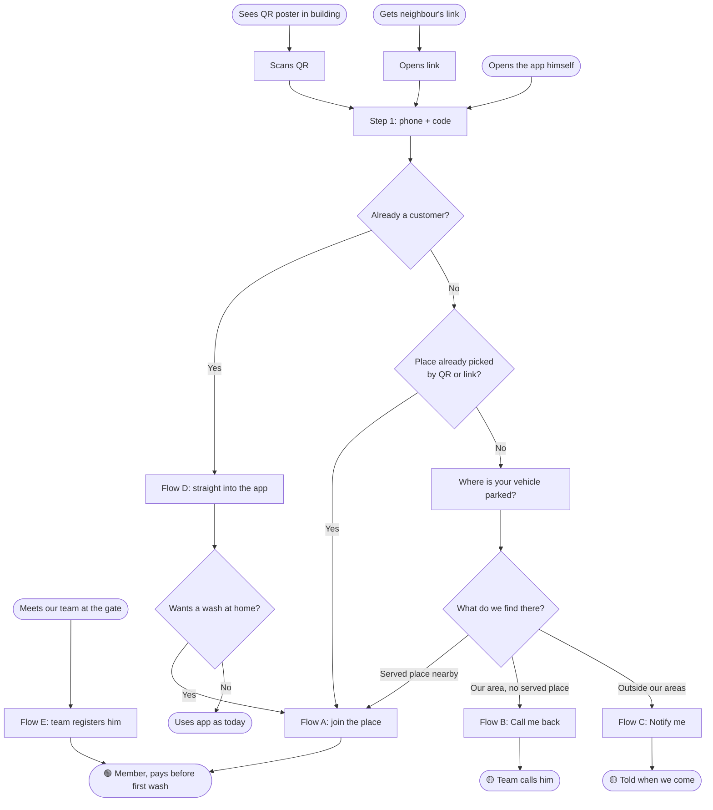
```mermaid
flowchart TD
    S1([Sees QR poster in building]) --> Q1[Scans QR]
    S2([Gets neighbour's link]) --> Q2[Opens link]
    S3([Opens the app himself]) --> P1
    S4([Meets our team at the gate]) --> E[Flow E: team registers him]
    Q1 --> P1[Step 1: phone + code]
    Q2 --> P1
    P1 --> D1{Already a customer?}
    D1 -- Yes --> D[Flow D: straight into the app]
    D1 -- No --> D2{Place already picked<br/>by QR or link?}
    D2 -- Yes --> A[Flow A: join the place]
    D2 -- No --> W[Where is your vehicle parked?]
    W --> D3{What do we find there?}
    D3 -- Served place nearby --> A
    D3 -- Our area, no served place --> B[Flow B: Call me back]
    D3 -- Outside our areas --> C[Flow C: Notify me]
    A --> R1([🟢 Member, pays before first wash])
    B --> R2([🟡 Team calls him])
    C --> R3([🟡 Told when we come])
    E --> R1
    D --> D4{Wants a wash at home?}
    D4 -- Yes --> A
    D4 -- No --> R4([Uses app as today])
```

---

### Chart 2. Step 1: sign in with phone

Same for everyone. About 5 seconds.

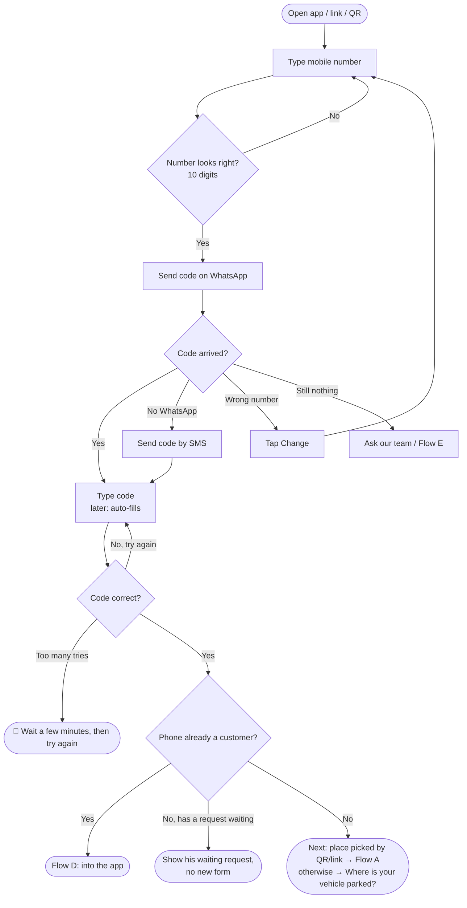
```mermaid
flowchart TD
    S([Open app / link / QR]) --> N[Type mobile number]
    N --> V{Number looks right?<br/>10 digits}
    V -- No --> N
    V -- Yes --> C[Send code on WhatsApp]
    C --> R{Code arrived?}
    R -- Yes --> T[Type code<br/>later: auto-fills]
    R -- No WhatsApp --> SMS[Send code by SMS]
    SMS --> T
    R -- Wrong number --> CH[Tap Change] --> N
    R -- Still nothing --> HELP[Ask our team / Flow E]
    T --> OK{Code correct?}
    OK -- No, try again --> T
    OK -- Too many tries --> WAIT([🔴 Wait a few minutes, then try again])
    OK -- Yes --> EX{Phone already a customer?}
    EX -- Yes --> D([Flow D: into the app])
    EX -- No, has a request waiting --> RQ([Show his waiting request,<br/>no new form])
    EX -- No --> NEXT([Next: place picked by QR/link → Flow A<br/>otherwise → Where is your vehicle parked?])
```

---

### Chart 3. Where is your vehicle parked? (choose A, B or C)

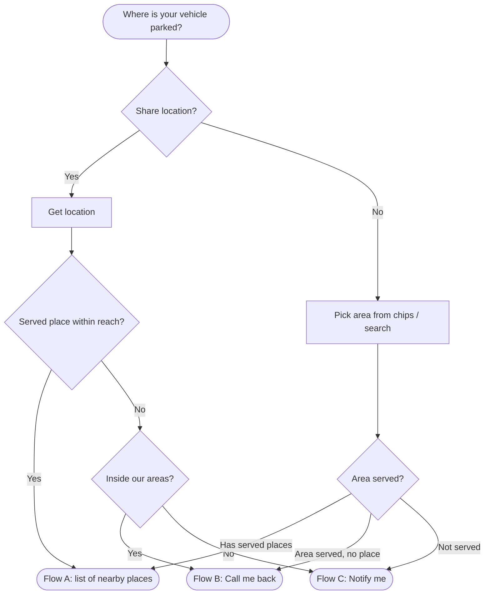
```mermaid
flowchart TD
    S([Where is your vehicle parked?]) --> L{Share location?}
    L -- Yes --> G[Get location]
    L -- No --> CH[Pick area from chips / search]
    G --> F{Served place within reach?}
    CH --> F2{Area served?}
    F -- Yes --> A([Flow A: list of nearby places])
    F -- No --> AR{Inside our areas?}
    AR -- Yes --> B([Flow B: Call me back])
    AR -- No --> C([Flow C: Notify me])
    F2 -- Has served places --> A
    F2 -- Area served, no place --> B
    F2 -- Not served --> C
```

---

### Chart 4. Flow A: joining a served place (full flow)

The main flow. About 15–20 seconds. Parts 1–4 below show each step in detail.

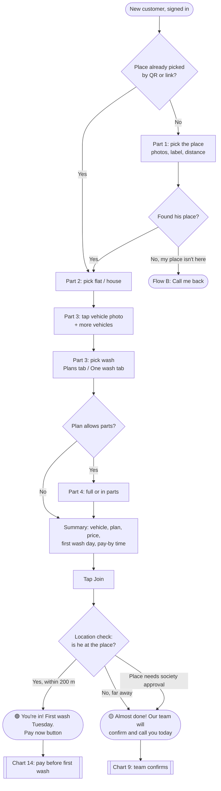
```mermaid
flowchart TD
    S([New customer, signed in]) --> P{Place already picked<br/>by QR or link?}
    P -- Yes --> FL
    P -- No --> PL[Part 1: pick the place<br/>photos, label, distance]
    PL --> NH{Found his place?}
    NH -- No, my place isn't here --> B([Flow B: Call me back])
    NH -- Yes --> FL[Part 2: pick flat / house]
    FL --> VH[Part 3: tap vehicle photo<br/>+ more vehicles]
    VH --> WS[Part 3: pick wash<br/>Plans tab / One wash tab]
    WS --> PP{Plan allows parts?}
    PP -- Yes --> PT[Part 4: full or in parts]
    PP -- No --> SUM
    PT --> SUM[Summary: vehicle, plan, price,<br/>first wash day, pay-by time]
    SUM --> J[Tap Join]
    J --> LC{Location check:<br/>is he at the place?}
    LC -- Yes, within 200 m --> IN([🟢 You're in! First wash Tuesday.<br/>Pay now button])
    LC -- No, far away --> TC([🟡 Almost done! Our team will<br/>confirm and call you today])
    LC -- Place needs society approval --> TC
    IN --> PAY[[Chart 14: pay before first wash]]
    TC --> CONF[[Chart 9: team confirms]]
```

---

### Chart 5. Flow A, part 1: picking the place

Handles buildings with and without names.

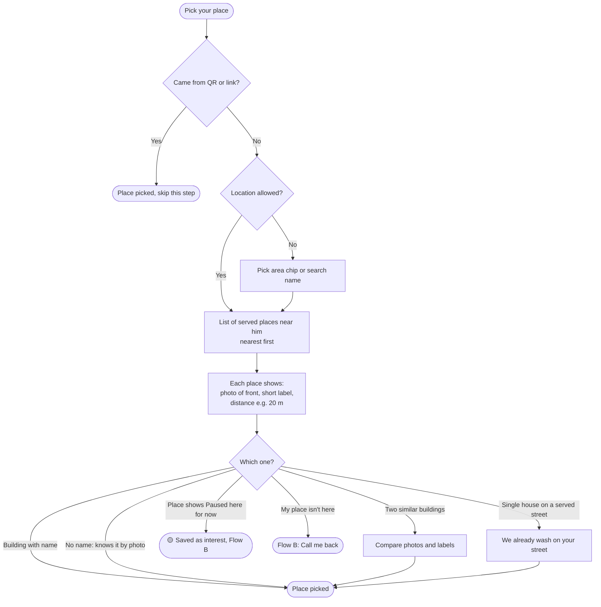
```mermaid
flowchart TD
    S([Pick your place]) --> QR{Came from QR or link?}
    QR -- Yes --> DONE([Place picked, skip this step])
    QR -- No --> LOC{Location allowed?}
    LOC -- Yes --> LIST[List of served places near him<br/>nearest first]
    LOC -- No --> AREA[Pick area chip or search name] --> LIST
    LIST --> CARD[Each place shows:<br/>photo of front, short label,<br/>distance e.g. 20 m]
    CARD --> PICK{Which one?}
    PICK -- Building with name --> DONE2([Place picked])
    PICK -- No name: knows it by photo --> DONE2
    PICK -- Two similar buildings --> PH[Compare photos and labels] --> DONE2
    PICK -- Single house on a served street --> ST[We already wash on your street] --> DONE2
    PICK -- Place shows Paused here for now --> INT([🟡 Saved as interest, Flow B])
    PICK -- My place isn't here --> B([Flow B: Call me back])
```

---

### Chart 6. Flow A, part 2: picking the flat / house

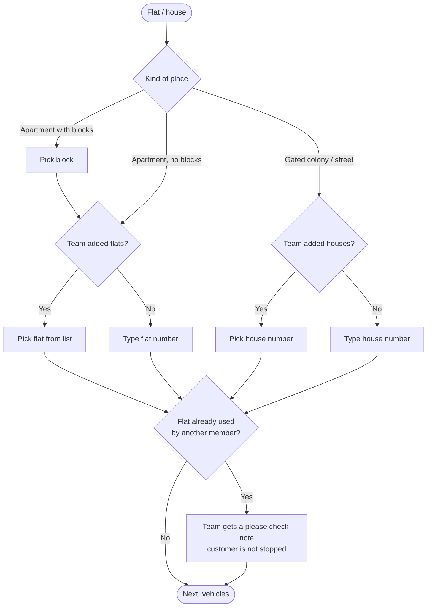
```mermaid
flowchart TD
    S([Flat / house]) --> K{Kind of place}
    K -- Apartment with blocks --> BL[Pick block] --> FLL
    K -- Apartment, no blocks --> FLL{Team added flats?}
    K -- Gated colony / street --> HN{Team added houses?}
    FLL -- Yes --> PF[Pick flat from list]
    FLL -- No --> TF[Type flat number]
    HN -- Yes --> PH[Pick house number]
    HN -- No --> TH[Type house number]
    PF --> U{Flat already used<br/>by another member?}
    TF --> U
    PH --> U
    TH --> U
    U -- No --> OK([Next: vehicles])
    U -- Yes --> NOTE[Team gets a please check note<br/>customer is not stopped] --> OK
```

---

### Chart 7. Flow A, part 3: vehicles and washes

A plan is for one vehicle. Each vehicle picks its own wash.

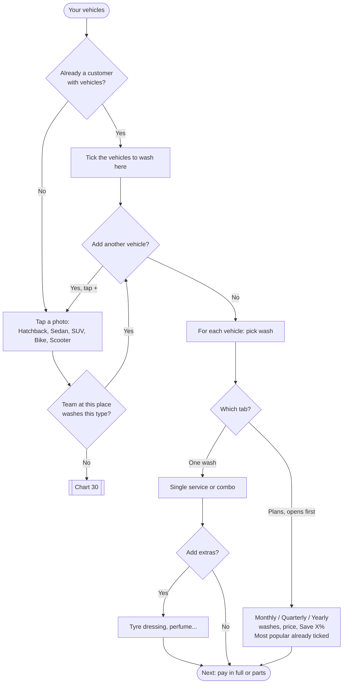
```mermaid
flowchart TD
    S([Your vehicles]) --> KN{Already a customer<br/>with vehicles?}
    KN -- Yes --> TICK[Tick the vehicles to wash here]
    KN -- No --> PIC[Tap a photo:<br/>Hatchback, Sedan, SUV, Bike, Scooter]
    PIC --> TEAM{Team at this place<br/>washes this type?}
    TEAM -- No --> CANT[[Chart 30]]
    TEAM -- Yes --> MORE{Add another vehicle?}
    TICK --> MORE
    MORE -- Yes, tap + --> PIC
    MORE -- No --> EACH[For each vehicle: pick wash]
    EACH --> TAB{Which tab?}
    TAB -- Plans, opens first --> PLAN[Monthly / Quarterly / Yearly<br/>washes, price, Save X%<br/>Most popular already ticked]
    TAB -- One wash --> ONE[Single service or combo]
    ONE --> EX{Add extras?}
    EX -- Yes --> EXT[Tyre dressing, perfume...] --> NEXT
    EX -- No --> NEXT
    PLAN --> NEXT([Next: pay in full or parts])
```

Plate number, make and model are **not asked** here. The washer records them at the first wash.

---

### Chart 8. Flow A, part 4: pay in full or in parts

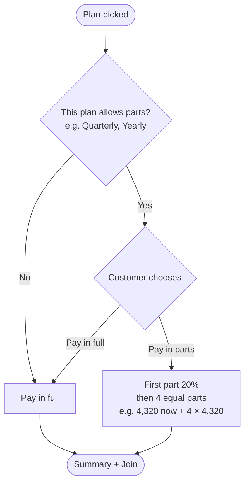
```mermaid
flowchart TD
    S([Plan picked]) --> AL{This plan allows parts?<br/>e.g. Quarterly, Yearly}
    AL -- No --> FULL[Pay in full]
    AL -- Yes --> CH{Customer chooses}
    CH -- Pay in full --> FULL
    CH -- Pay in parts --> PARTS[First part 20%<br/>then 4 equal parts<br/>e.g. 4,320 now + 4 × 4,320]
    FULL --> SUM([Summary + Join])
    PARTS --> SUM
```

---

### Chart 9. Location check and team confirmation

Stops outsiders without being rude. We never say "cheating".

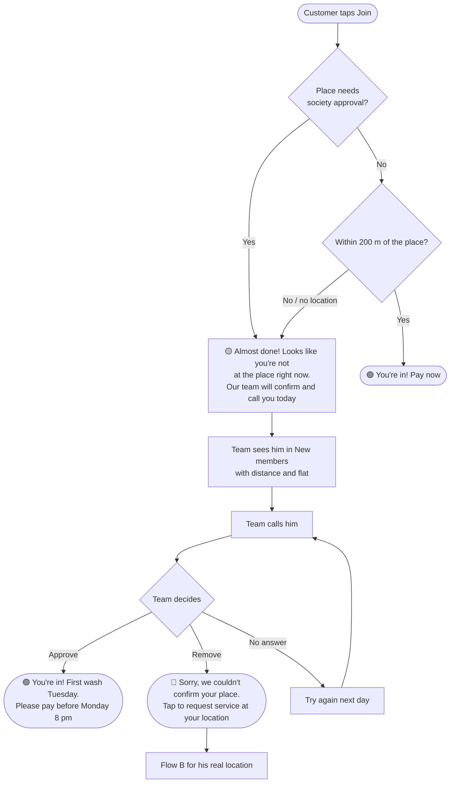
```mermaid
flowchart TD
    S([Customer taps Join]) --> AP{Place needs<br/>society approval?}
    AP -- Yes --> WAIT
    AP -- No --> D{Within 200 m of the place?}
    D -- Yes --> IN([🟢 You're in! Pay now])
    D -- No / no location --> WAIT[🟡 Almost done! Looks like you're not<br/>at the place right now.<br/>Our team will confirm and call you today]
    WAIT --> T[Team sees him in New members<br/>with distance and flat]
    T --> CALL[Team calls him]
    CALL --> DEC{Team decides}
    DEC -- Approve --> OK([🟢 You're in! First wash Tuesday.<br/>Please pay before Monday 8 pm])
    DEC -- Remove --> NO([🔴 Sorry, we couldn't confirm your place.<br/>Tap to request service at your location])
    NO --> B[Flow B for his real location]
    DEC -- No answer --> RE[Try again next day] --> CALL
```

---

### Chart 10. Flow B: place not served yet ("Call me back")

About 15 seconds. Every request becomes **interest** for that place.

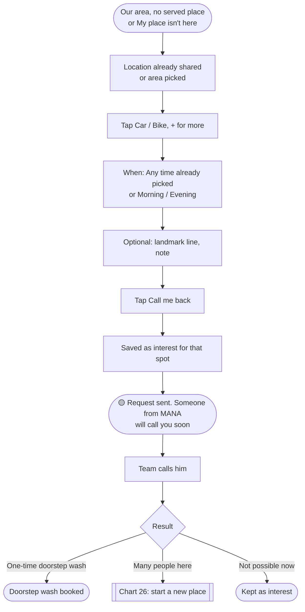
```mermaid
flowchart TD
    S([Our area, no served place<br/>or My place isn't here]) --> LOC[Location already shared<br/>or area picked]
    LOC --> V[Tap Car / Bike, + for more]
    V --> WH[When: Any time already picked<br/>or Morning / Evening]
    WH --> OPT[Optional: landmark line, note]
    OPT --> BTN[Tap Call me back]
    BTN --> SAVE[Saved as interest for that spot]
    SAVE --> MSG([🟡 Request sent. Someone from MANA<br/>will call you soon])
    MSG --> TEAM[Team calls him]
    TEAM --> DEC{Result}
    DEC -- One-time doorstep wash --> DW([Doorstep wash booked])
    DEC -- Many people here --> NP[[Chart 26: start a new place]]
    DEC -- Not possible now --> KEEP([Kept as interest])
```

---

### Chart 11. Flow C: outside our areas ("Notify me")

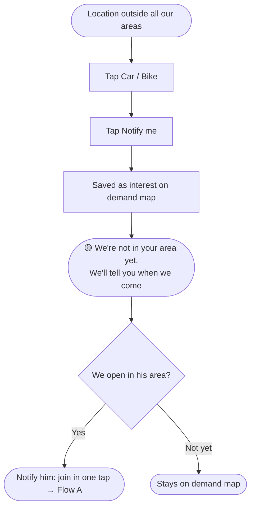
```mermaid
flowchart TD
    S([Location outside all our areas]) --> V[Tap Car / Bike]
    V --> BTN[Tap Notify me]
    BTN --> SAVE[Saved as interest on demand map]
    SAVE --> MSG([🟡 We're not in your area yet.<br/>We'll tell you when we come])
    MSG --> LATER{We open in his area?}
    LATER -- Yes --> TELL([Notify him: join in one tap → Flow A])
    LATER -- Not yet --> KEEP([Stays on demand map])
```

---

### Chart 12. Flow D: existing shop customer

Never registers twice.

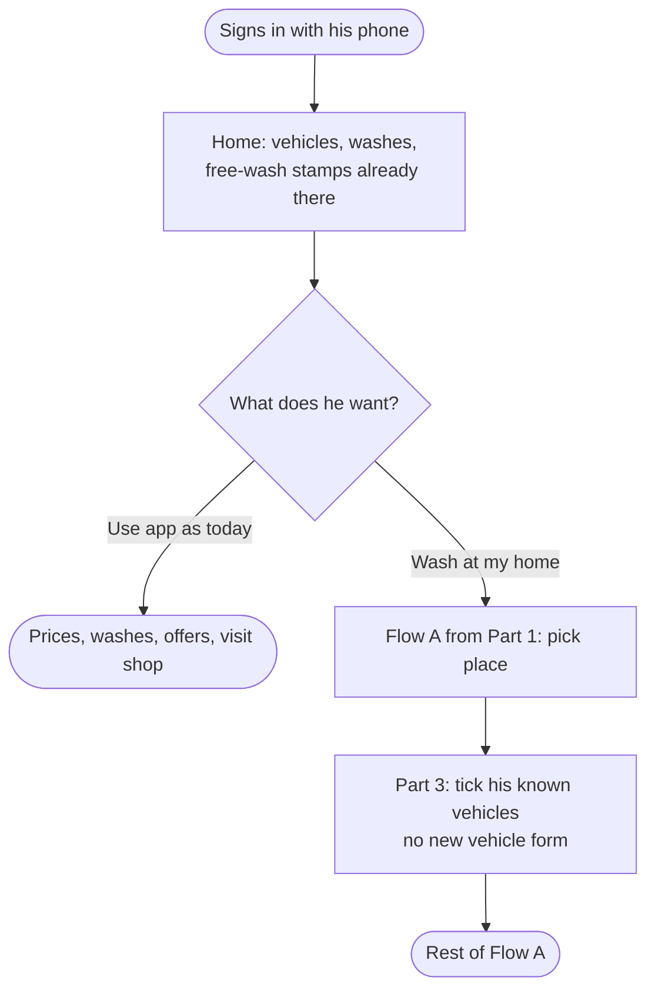
```mermaid
flowchart TD
    S([Signs in with his phone]) --> HOME[Home: vehicles, washes,<br/>free-wash stamps already there]
    HOME --> Q{What does he want?}
    Q -- Use app as today --> END1([Prices, washes, offers, visit shop])
    Q -- Wash at my home --> A[Flow A from Part 1: pick place]
    A --> SK[Part 3: tick his known vehicles<br/>no new vehicle form]
    SK --> REST([Rest of Flow A])
```

---

### Chart 13. Flow E: team registers a customer

For people without a smartphone, elderly people, or at the gate.

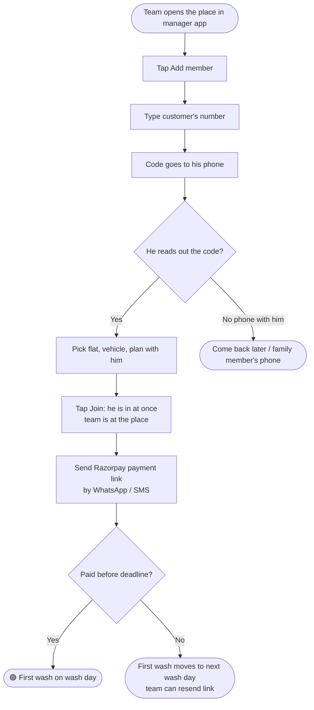
```mermaid
flowchart TD
    S([Team opens the place in manager app]) --> ADD[Tap Add member]
    ADD --> NUM[Type customer's number]
    NUM --> CODE[Code goes to his phone]
    CODE --> READ{He reads out the code?}
    READ -- Yes --> FL[Pick flat, vehicle, plan with him]
    READ -- No phone with him --> LATER([Come back later / family member's phone])
    FL --> JOIN[Tap Join: he is in at once<br/>team is at the place]
    JOIN --> LINK[Send Razorpay payment link<br/>by WhatsApp / SMS]
    LINK --> PAID{Paid before deadline?}
    PAID -- Yes --> OK([🟢 First wash on wash day])
    PAID -- No --> MOVE([First wash moves to next wash day<br/>team can resend link])
```

---

### Chart 14. Paying before the first wash

Nobody is washed before paying. Joining itself is free.

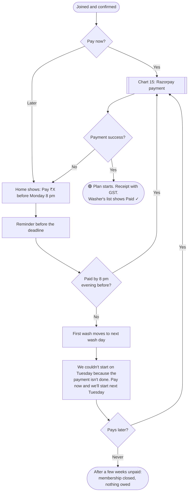
```mermaid
flowchart TD
    S([Joined and confirmed]) --> NOW{Pay now?}
    NOW -- Yes --> RP[[Chart 15: Razorpay payment]]
    NOW -- Later --> HOME[Home shows: Pay ₹X before Monday 8 pm]
    HOME --> REM[Reminder before the deadline]
    REM --> PAID{Paid by 8 pm<br/>evening before?}
    PAID -- Yes --> RP
    PAID -- No --> MOVE[First wash moves to next wash day]
    MOVE --> MSG[We couldn't start on Tuesday because the<br/>payment isn't done. Pay now and we'll start next Tuesday]
    MSG --> PAID2{Pays later?}
    PAID2 -- Yes --> RP
    PAID2 -- Never --> AUTO([After a few weeks unpaid:<br/>membership closed, nothing owed])
    RP --> OK{Payment success?}
    OK -- Yes --> START([🟢 Plan starts. Receipt with GST.<br/>Washer's list shows Paid ✓])
    OK -- No --> HOME
```

---

### Chart 15. A Razorpay payment (success, fail, pending)

Same for first payment, parts, renewals, one washes.

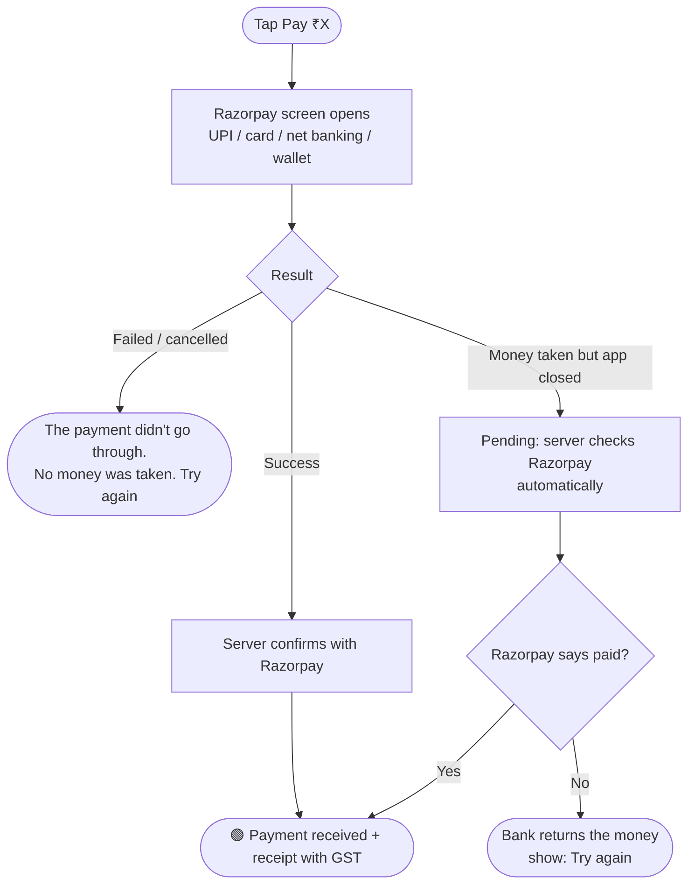
```mermaid
flowchart TD
    S([Tap Pay ₹X]) --> RZ[Razorpay screen opens<br/>UPI / card / net banking / wallet]
    RZ --> R{Result}
    R -- Success --> CONF[Server confirms with Razorpay]
    CONF --> OK([🟢 Payment received + receipt with GST])
    R -- Failed / cancelled --> FAIL([The payment didn't go through.<br/>No money was taken. Try again])
    R -- Money taken but app closed --> PEND[Pending: server checks Razorpay<br/>automatically]
    PEND --> CHK{Razorpay says paid?}
    CHK -- Yes --> OK
    CHK -- No --> REF([Bank returns the money<br/>show: Try again])
```

---

### Chart 16. First wash day (washer)

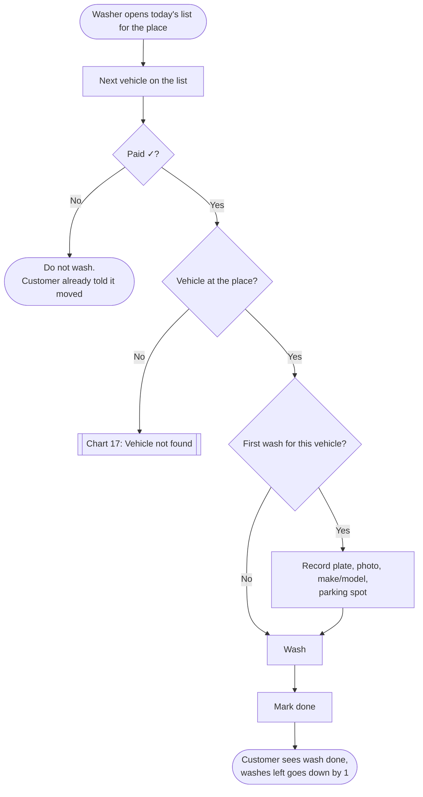
```mermaid
flowchart TD
    S([Washer opens today's list for the place]) --> V[Next vehicle on the list]
    V --> P{Paid ✓?}
    P -- No --> SKIPV([Do not wash.<br/>Customer already told it moved])
    P -- Yes --> F{Vehicle at the place?}
    F -- No --> NF[[Chart 17: Vehicle not found]]
    F -- Yes --> FIRST{First wash for this vehicle?}
    FIRST -- Yes --> REC[Record plate, photo, make/model,<br/>parking spot]
    FIRST -- No --> WASH
    REC --> WASH[Wash]
    WASH --> DONE[Mark done]
    DONE --> CUST([Customer sees wash done,<br/>washes left goes down by 1])
```

---

### Chart 17. Vehicle not found

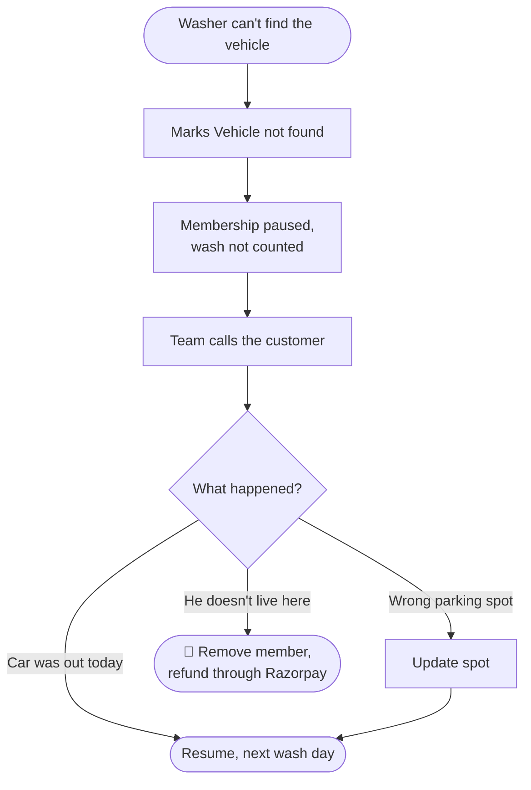
```mermaid
flowchart TD
    S([Washer can't find the vehicle]) --> M[Marks Vehicle not found]
    M --> PAUSE[Membership paused,<br/>wash not counted]
    PAUSE --> T[Team calls the customer]
    T --> DEC{What happened?}
    DEC -- Car was out today --> NEXT([Resume, next wash day])
    DEC -- Wrong parking spot --> FIX[Update spot] --> NEXT
    DEC -- He doesn't live here --> REM([🔴 Remove member,<br/>refund through Razorpay])
```

---

### Chart 18. Pay in parts: due, late, pause, resume

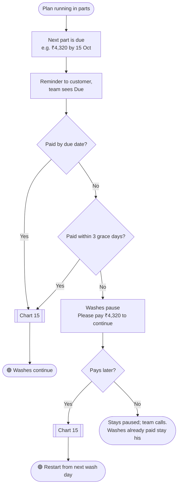
```mermaid
flowchart TD
    S([Plan running in parts]) --> DUE[Next part is due<br/>e.g. ₹4,320 by 15 Oct]
    DUE --> REM[Reminder to customer,<br/>team sees Due]
    REM --> P{Paid by due date?}
    P -- Yes --> RP[[Chart 15]] --> GO([🟢 Washes continue])
    P -- No --> G{Paid within 3 grace days?}
    G -- Yes --> RP
    G -- No --> PAUSE[Washes pause<br/>Please pay ₹4,320 to continue]
    PAUSE --> P2{Pays later?}
    P2 -- Yes --> RP2[[Chart 15]] --> RES([🟢 Restart from next wash day])
    P2 -- No --> LONG([Stays paused; team calls.<br/>Washes already paid stay his])
```

---

### Chart 19. Skip one wash

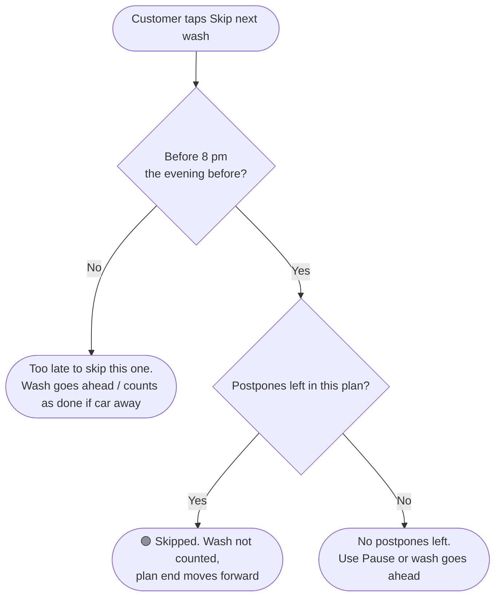
```mermaid
flowchart TD
    S([Customer taps Skip next wash]) --> T{Before 8 pm<br/>the evening before?}
    T -- No --> LATE([Too late to skip this one.<br/>Wash goes ahead / counts as done if car away])
    T -- Yes --> L{Postpones left in this plan?}
    L -- Yes --> OK([🟢 Skipped. Wash not counted,<br/>plan end moves forward])
    L -- No --> NO([No postpones left.<br/>Use Pause or wash goes ahead])
```

---

### Chart 20. Pause for a holiday

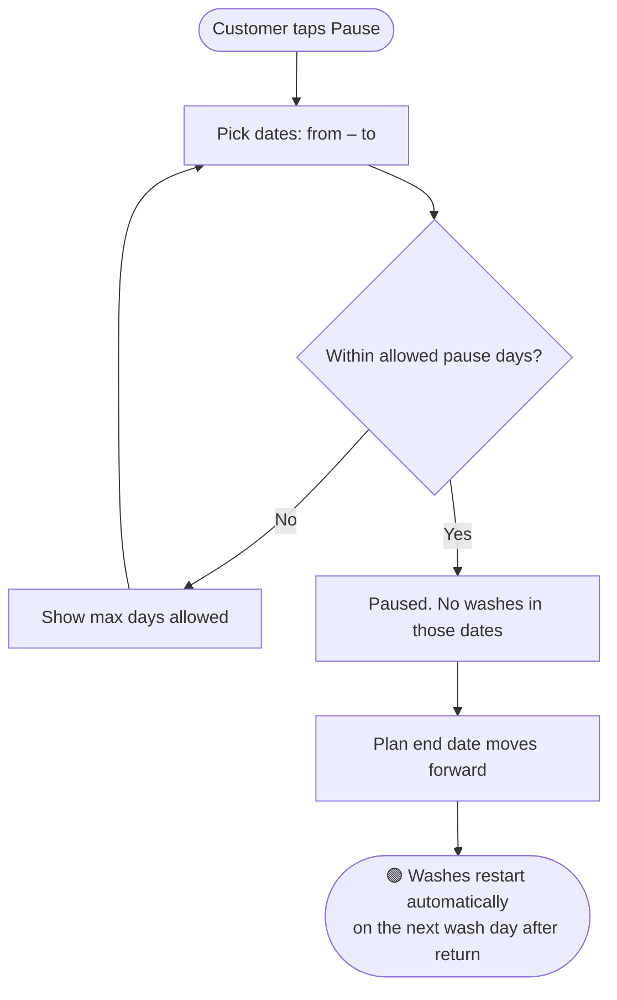
```mermaid
flowchart TD
    S([Customer taps Pause]) --> D[Pick dates: from – to]
    D --> L{Within allowed pause days?}
    L -- No --> SH[Show max days allowed] --> D
    L -- Yes --> OK[Paused. No washes in those dates]
    OK --> FWD[Plan end date moves forward]
    FWD --> BACK([🟢 Washes restart automatically<br/>on the next wash day after return])
```

---

### Chart 21. Cancel and refund

```mermaid
flowchart TD
    S([Customer taps Cancel]) --> P{Has he paid?}
    P -- No --> C1([Cancelled. Nothing to pay])
    P -- Yes --> W{Any wash done yet?}
    W -- No --> FULL([🟢 Full refund through Razorpay])
    W -- Yes --> CALC[Done washes charged at one-wash price<br/>rest refunded]
    CALC --> R{Anything left to refund?}
    R -- Yes --> PART([Refund the rest through Razorpay])
    R -- No --> ZERO([Plan closed, no refund due])
```

Refunds go back to the same card/UPI/bank through Razorpay.

---

### Chart 22. Plan ending and renewal

No automatic charge.

```mermaid
flowchart TD
    S([7 days before plan ends]) --> M[Your yearly plan ends on 12 Oct. Renew?]
    M --> D{Customer's choice}
    D -- Renew same plan --> RP[[Chart 15]] --> GO([🟢 New plan starts after the last wash])
    D -- Change plan --> PICK[Pick another plan] --> RP
    D -- Does nothing --> LAST[Last wash happens]
    LAST --> STOP([Washes stop. Still a member,<br/>can renew any time])
```

---

### Chart 23. One wash at a place

```mermaid
flowchart TD
    S([Member picks One wash tab]) --> W[Pick service / combo + extras]
    W --> DAY[Shows: on the next wash day, Tuesday]
    DAY --> PAY{Paid before 8 pm Monday?}
    PAY -- Yes --> OK([🟢 Washed on Tuesday, receipt])
    PAY -- No --> MOVE([Moves to the following wash day])
```

---

### Chart 24. Adding another vehicle

```mermaid
flowchart TD
    S([Member taps + Add vehicle]) --> PIC[Tap a photo for the type]
    PIC --> W[Pick its own plan or one wash]
    W --> PAY[[Chart 14: pay before its first wash]]
    PAY --> OK([🟢 Both vehicles on the wash list])
```

---

### Chart 25. Moving out / new tenant

```mermaid
flowchart TD
    S([Customer taps I'm moving]) --> N{New place served by us?}
    N -- Yes --> MV[Pick new place + flat] --> KEEP([🟢 Plan moves with him,<br/>washes left stay])
    N -- No --> C[Cancel → Chart 21<br/>or Pause]
    C --> B([New location saved as interest])
    T([New tenant in the same flat]) --> J[Joins fresh with Flow A]
    J --> NOTE([Old member already ended,<br/>so no please check note])
```

---

### Chart 26. Interest grows into a new place

```mermaid
flowchart TD
    S([Call me back / Notify me requests]) --> GR[Grouped by spot on the team's<br/>demand list: 5 people at Street 3]
    GR --> D{Enough people?}
    D -- Not yet --> WAIT([Keep collecting])
    D -- Yes --> SET[[Chart 33: team sets up the place]]
    SET --> TELL[Everyone who asked gets:<br/>We now wash at your place. Join?]
    TELL --> ONE[One tap → Flow A with place picked]
    ONE --> OK([🟢 New members])
```

---

### Chart 27. Place is full: waiting list

```mermaid
flowchart TD
    S([Customer joins]) --> F{Team has room on<br/>this wash day?}
    F -- Yes --> OK([Normal: first wash this week])
    F -- No --> WL[Waiting list:<br/>We'll start you next week]
    WL --> PAY[Payment asked only when<br/>his first wash day is fixed]
    PAY --> GO([🟢 Starts when a slot opens])
```

---

### Chart 28. Society needs approval

```mermaid
flowchart TD
    S([Place marked Needs approval]) --> J[Customer joins]
    J --> W([🟡 Our team will confirm and call you today])
    W --> T[Team checks with secretary / society]
    T --> D{Allowed?}
    D -- Yes --> OK([🟢 You're in. Pay before first wash])
    D -- No --> NO([🔴 Sorry, we can't wash here yet.<br/>Saved as interest])
```

---

### Chart 29. Flat or plate already used

```mermaid
flowchart TD
    S([Customer picks flat / adds plate]) --> U{Already used by<br/>another member?}
    U -- No --> OK([Continue normally])
    U -- Yes --> N[Customer is not stopped<br/>team gets a please check note]
    N --> T[Team checks]
    T --> D{Result}
    D -- Same family / both fine --> KEEP([Keep both])
    D -- Old member moved out --> ENDM([End old membership])
    D -- Wrong entry --> FIX([Fix flat / plate])
```

---

### Chart 30. Vehicle the team can't wash

```mermaid
flowchart TD
    S([Customer picks a vehicle type]) --> C{Team at this place<br/>washes this type?}
    C -- Yes --> OK([Continue])
    C -- No --> MSG[This team washes cars and bikes here]
    MSG --> B([Offer Call me back → Flow B])
```

---

### Chart 31. No internet while joining

```mermaid
flowchart TD
    S([Customer fills the steps]) --> N{Internet on when<br/>tapping Join?}
    N -- Yes --> OK([Sent normally])
    N -- No --> KEEP[App keeps everything he picked<br/>shows: Will send when online]
    KEEP --> BACK{Signal back?}
    BACK -- Yes --> SEND([Sent automatically])
    BACK -- Closes app --> RE([Next open: Continue where you left?])
```

Payment always needs internet. Without it the Pay button waits.

---

### Chart 32. Managing my plan in the app

Details will be designed with scheduling. This is the shape.

```mermaid
flowchart TD
    S([My plan screen, per vehicle]) --> I[Shows: plan name, washes left,<br/>next wash day, paid / next part due]
    I --> A{What does he do?}
    A -- Skip next wash --> C19[[Chart 19]]
    A -- Pause --> C20[[Chart 20]]
    A -- Pay a part --> C18[[Chart 18]]
    A -- See receipts --> R([List of receipts with GST])
    A -- Renew / change --> C22[[Chart 22]]
    A -- Cancel --> C21[[Chart 21]]
    A -- I'm moving --> C25[[Chart 25]]
    A -- Problem with a wash --> P([Report a problem, as today])
```

---

### Chart 33. Team sets up a new place

```mermaid
flowchart TD
    S([Team at the new place]) --> ADD[Manager app: Add place]
    ADD --> PIN[Use my location → map pin]
    PIN --> PH[Take one photo of the front]
    PH --> LB[Short label locals use<br/>e.g. Opp. Ramalayam, Gandhi Nagar]
    LB --> K{Kind}
    K -- Building --> BF[Add blocks and flats, optional]
    K -- Colony --> HS[Add house numbers, optional]
    K -- Street --> SR[Add houses, optional]
    BF --> DAY
    HS --> DAY
    SR --> DAY[Set wash day and time]
    DAY --> AP{Society approval needed?}
    AP -- Yes --> MK[Mark Needs approval] --> QR
    AP -- No --> QR[Print QR poster]
    QR --> LIVE([🟢 Place live: shows in app,<br/>QR and links work])
```
