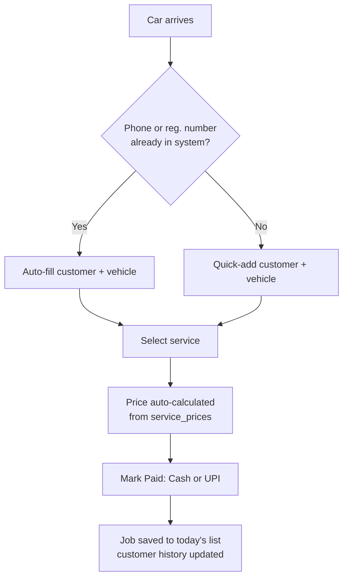
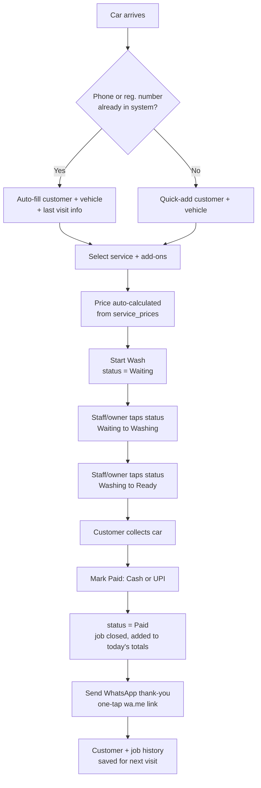
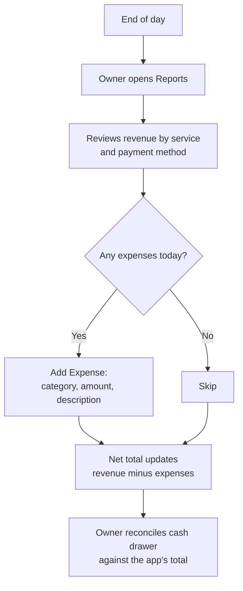
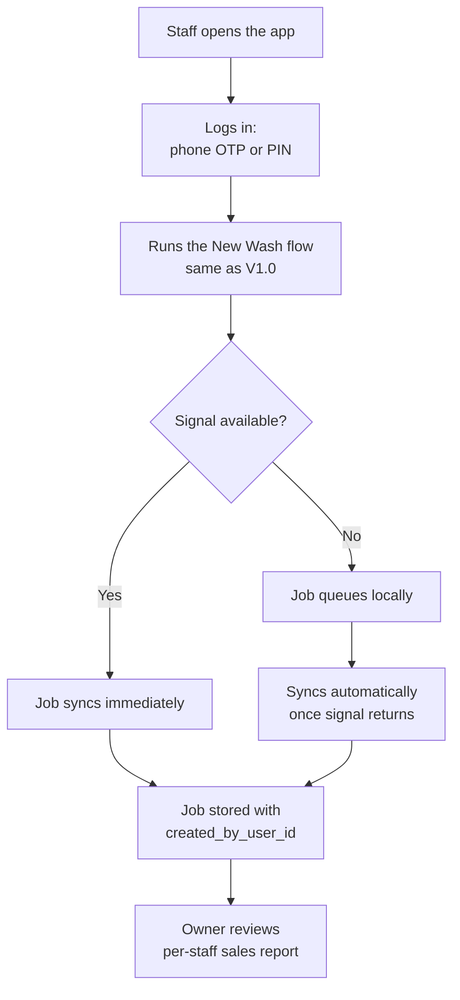
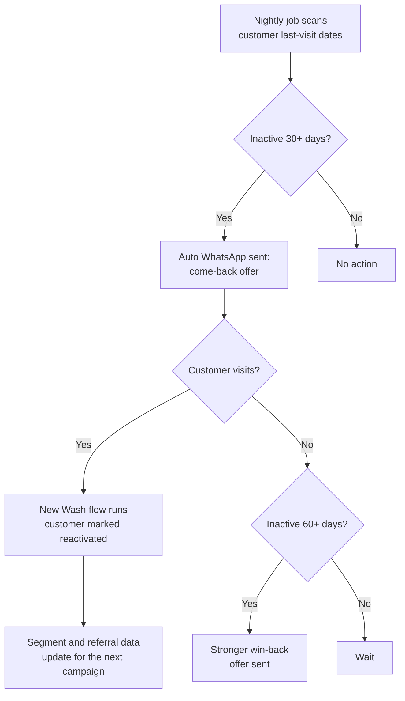
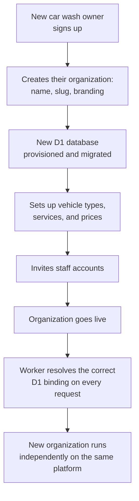

# MANA Wash Manager — App Build Plan

2026-09-22 · @Someone

MANA Wash Manager is built in five versions, each with its own goal, its own feature table, and why it exists. The database and codebase are designed once, professionally, so that adding a new service or price is a data change, and turning MANA into a white-label platform for other car washes later is a matter of switching features on — not a rewrite.

## Version overview

| Version | Name | Goal | Elapsed time |
| --- | --- | --- | --- |
| V0.1 | Paper Replacement | Stop losing customer/job data to a notebook | Week 1 |
| V1.0 | Daily Driver | Run every wash through the app, end to end | Week 2–3 |
| V1.2 | Owner Accountability | Know where the money went, not just what came in | Week 4 |
| V2.0 | Team Ready | Staff can run it without the owner present | Week 6–8 |
| V3.0 | Growth Engine | Turn the customer list into repeat revenue | Month 3–4 |
| V4.0 | White-Label Expansion | Onboard a second car wash onto the same platform | Triggered by real demand, not calendar |

Each version is a real, usable release — not a demo. The gate to the next version is "is this one a stable daily habit," never the calendar.

## Implementation status (as of 2026-09-23)

V0.1 and **all of V1.0** are built and verified — not just planned. Treat this section as the honest source of truth; update it as work lands rather than trusting the feature tables below to reflect reality on their own.

**Done, verified on a real device** (a USB-connected Android phone, running against the real API and a real Cloudflare D1 database — not a simulator, not mocked):

- Monorepo scaffolded exactly as in Tech stack: `apps/mobile` (React Native CLI, **Android only**), `apps/api` (Cloudflare Worker + Hono), `packages/domain`, `packages/db`
- Prisma schema + hand-written D1 migration SQL, seeded with MANA's real menu — verified by running the actual SQL against real SQLite
- Domain logic (`calculatePrice`, `canTransition`) — 13/13 unit tests passing, strict-mode clean
- API routes: OTP login (dev bypass — see Pending), customer lookup/create/**profile with lifetime stats**, service + vehicle-type list/create, price upsert, job create/list-today/**stats**/update-status/mark-paid, all owner-role-gated where it matters
- **Job creation and status changes return clean 4xx errors for real operator mistakes** (a service with no price set for the selected vehicle type, a discount larger than the subtotal, an already-paid job tapped twice, a job id that no longer exists) instead of a raw 500 — verified via direct API calls for every case
- **"Today"/"this week" boundaries are computed in IST (UTC+5:30), not the Worker's own UTC clock** — a real bug fixed this pass: Cloudflare Workers run in UTC, so a naive `new Date(); setHours(0,0,0,0)` would have misfiled washes done in the first ~5.5 hours of the IST day as "yesterday"
- Mobile screens: **Login**, **New Wash** (lookup → multi-service select → live price → optional discount → submit), **Job Board** (list, status advance, mark paid, WhatsApp thank-you, auto-refresh on focus), **Settings** (owner-only: edit prices, add a vehicle type, add a service), **Customer Profile** (visit count, lifetime spend, last visit, vehicles, full job history), **Reports** (Today / Last-7-days toggle: revenue, cars washed, pending now, new vs repeat customers, cash/UPI/other split)
- Full job lifecycle tested repeatedly on-device: Waiting → Washing → Ready → Paid, multi-service pricing verified correct (e.g. Mini SUV Exterior Wash + Tyre Dressing = ₹350 + ₹50 = ₹400)
- Owner settings fully exercised on-device: edited an existing price, added a vehicle type ("Bike"), added a new service ("Ceramic Coating") — the new service correctly showed blank "Set price" cells across all five vehicle types, including the one added moments earlier in the same session
- **Discount flow fully exercised on-device**: entering a discount larger than the subtotal blocks submission with an inline error; entering a discount with no reason blocks submission with a different inline error (the server rejects both independently too — a bare `discount > 0` with no `discountReason` is a 400, matching V1.0's own "discounts require a reason" line); a valid discount + reason submits correctly and the job board shows the discounted total
- **WhatsApp thank-you verified live**: tapping the WhatsApp action on a paid job opens the real WhatsApp app with the correct customer phone number and a pre-filled thank-you message referencing that customer's vehicle
- **Customer Profile verified live**: correct visit count, lifetime spend (paid jobs only), last visit, vehicle list, and full chronological job history for a real customer
- **Reports verified live**: Today/Last-7-days toggle recomputes correctly; payment-split bars are proportioned correctly against total revenue; new-vs-repeat customer counts match manual verification against seeded test data
- `mana_db` created for real on Cloudflare; local migrations applied; the Worker serves real seeded data via `wrangler dev`
- Repo pushed to GitHub: `admin-sprixia/ManaWashManager`, `main` branch
- Real bugs found and fixed during device testing — worth knowing if you touch this code: Gradle's node_modules paths in a monorepo, Metro not resolving `package.json` "exports" (broke Hono's client), Hermes' incomplete `URLSearchParams` (needed a polyfill), the Job Board not refreshing after navigating back to it, a seeded phone number that didn't match what the login screen actually sends, the UTC-vs-IST day-boundary bug above, and (in testing itself, not the app) `adb`'s tap coordinates drifting whenever the screen scrolls or a `LayoutAnimation` reflows the list — fixed by re-reading exact element bounds via `uiautomator dump` before every tap instead of reusing coordinates across screen states

**Pending for V0.1/V1.0 to be fully "done":**

- A real MSG91 account and secret — still running on the `DEV_OTP_BYPASS` dev-only shortcut (phone `9100000000`, code `000000`)
- `wrangler d1 migrations apply mana_db --remote` — the real D1 database is provisioned but still empty; only the local dev copy has data
- `npm run deploy` — the Worker only runs locally (`wrangler dev` + `adb reverse`); there's no public `*.workers.dev` URL yet
- Automated on-device tests (Maestro) — all testing so far has been manual (live device + adb), not automated
- iOS build — deliberately out of scope per your direction (Android-only; MANA's customer base doesn't use iPhones). No `ios/` folder exists.

**V1.2, V2.0, V3.0, V4.0:** not started, as planned — nothing here has been pulled forward.

## Architecture and engineering principles

These are non-negotiable from the very first commit, because retrofitting them onto a live app with real transaction history is far more expensive than building them in now.

| Principle | What it means here |
| --- | --- |
| Strict TypeScript | `strict: true`, `noUncheckedIndexedAccess`, no `any` — every job, price and customer record is a typed object end to end, client to database |
| Single source of truth for types | Database schema (Prisma) generates the types; API layer validates with Zod schemas derived from the same models — the shape is never hand-duplicated in three places |
| Layered architecture | `domain` (business rules: pricing, job status transitions) → `application` (use cases: "start a wash", "mark paid") → `infrastructure` (database, WhatsApp, payments) → `presentation` (mobile app screens). Business rules never import UI code, so the same domain logic can power both the mobile app and a future admin web tool, without duplicating business rules — see "Layered architecture detail" below |
| Repository pattern | All database access goes through typed repository functions (`customerRepo.findByPhone(phone)`) that run against the Worker's currently-bound D1 database, never raw queries scattered through screens — swapping databases or adding caching later touches one file |
| Multi-tenant-ready, single-tenant-run | Every organization gets its own D1 database from the start (see Data model). V1–V3 simply run against MANA's one database, with the Worker already wired to resolve "which D1 binding for this request" — so V4 (white-label) is provisioning a new database and binding per organization, not a migration of live data |
| Owner-editable configuration, not hardcoded constants | Services, prices, and vehicle types live in database tables the owner edits from a settings screen, never as constants in code — adding a new service or changing a price is a form submission, not a code deploy |
| Testing from V1 | Domain logic (pricing calculation, discount rules, job status transitions) gets unit tests from the start; these are the rules most likely to have real money riding on a bug |
| Consistent code style | ESLint (typescript-eslint strict + recommended) and Prettier enforced via a pre-commit hook — one style regardless of who touches the code later |

### Layered architecture detail

```text
presentation/   React Native (CLI) screens, React components — renders data, calls application layer
application/    use-cases: startWash(), markPaid(), addExpense() — orchestrates, no SQL, no JSX
domain/         pure business rules: calculatePrice(), canTransition(status) — no I/O, fully unit-testable
infrastructure/ Prisma repositories, WhatsApp client, auth — the only layer that talks to the outside world
```

A rule such as "a job can't go from Waiting straight to Paid" lives in `domain` and is tested in isolation — it doesn't care whether it's called from the mobile app, a future admin panel, or a script.

## Data model

Two design decisions make this schema extensible without ever needing a rewrite:

1. **Every organization gets its own D1 (SQLite) database.** MANA's app runs against one database today. Onboarding a second car wash (V4) means provisioning a new D1 database and binding it to that organization's requests — not adding rows to a shared table. There's no `organization_id` column to remember on every table, and no row-level security policy that could be misconfigured: isolation is physical.
2. **Services and prices are rows, not columns.** Instead of a `hatchback_price` / `sedan_price` column pair (which breaks the moment MANA adds a new vehicle category or a new service), pricing is a `service_prices` join table. The owner adds a service or a vehicle type from a settings screen — zero code changes, zero migrations.

```text
users
  id, name, phone, role (owner/staff), created_at

vehicle_types
  id, name ("Hatchback", "Sedan", …), sort_order
  → owner-editable list, not an enum baked into code

services
  id, name, description, active, sort_order

service_prices
  id, service_id, vehicle_type_id, price
  → the actual price matrix; adding a service or vehicle type auto-creates blank cells here for the owner to fill in

customers
  id, name, phone (unique), source (google/friend/board/instagram/other),
  marketing_consent, created_at

vehicles
  id, customer_id, registration_number (unique), make, model, vehicle_type_id

jobs
  id, customer_id, vehicle_id, created_by_user_id, status
  (waiting/washing/ready/paid/void), subtotal, discount, discount_reason,
  total, payment_method (cash/upi/other), payment_status, created_at, completed_at

job_services
  job_id, service_id, price_at_time, quantity
  → price is COPIED onto the job at creation time, so a later price change never rewrites historical revenue

expenses          -- from V1.2
  id, category, amount, description, date, created_by_user_id
```

Why `price_at_time` on `job_services` instead of always joining to the live price: a wash charged ₹500 in March must still show ₹500 in March's reports even after the owner raises prices in April. This single decision is what makes historical reporting trustworthy as prices change over time — a detail that's easy to miss and expensive to fix after the fact.

## V0.1 — Paper Replacement

**Goal:** replace the notebook/memory-based job tracking with something that never loses a customer's phone number or a car's service history.

**Why:** this is the smallest possible slice that is still safe to run on real customers on day one, and it proves the core data model (organizations → customers → vehicles → jobs) before anything else is built on top of it.

| Feature | Description | Priority | Status |
| --- | --- | --- | --- |
| New job entry | Phone or reg. number lookup → auto-fill existing customer, or quick-add a new one | Must have | ✅ Done |
| Service picker | Select from the owner's current service list, price auto-fills from `service_prices` | Must have | ✅ Done |
| Mark paid | Cash or UPI, total shown before confirming | Must have | ✅ Done |
| Job list (today) | Flat list of today's jobs — no status board yet, that's V1.0 | Must have | ✅ Done (superseded by V1.0's status board, also done) |
| Owner settings: services & prices | Add/edit a service, add/edit a vehicle type, set prices — built now because V0.1 has nothing to seed it with otherwise | Must have | ✅ Done — editing prices, adding a vehicle type, and adding a service are all tested on-device |

### Final flow of V0.1



| Step | Who | Action | Screen |
| --- | --- | --- | --- |
| 1 | Owner | Enter the customer's phone or the car's registration number | New Job |
| 2 | App | Existing customer → auto-fill; new → quick-add form | New Job |
| 3 | Owner | Select the service | New Job |
| 4 | App | Price calculated automatically from the current price list | New Job |
| 5 | Owner | Collect payment, mark Cash or UPI | New Job |
| 6 | App | Job saved, added to today's list and the customer's history | Today's Jobs |

No status board yet — that's what V1.0 adds on top of this same core flow.

## V1.0 — Daily Driver

**Goal:** every wash at MANA, from car arrival to WhatsApp thank-you, runs through the app — nothing happens on paper.

**Why:** V0.1 proved the data model; V1.0 makes the app the actual system of record, with live job status so the owner (or a customer waiting) can see where every car is right now.

### Feature table

| Feature | Description | Priority | Status |
| --- | --- | --- | --- |
| Today dashboard | Cars washed, revenue, cash vs UPI split, pending jobs | Must have | ✅ Done — Reports screen, "Today" toggle; verified on-device |
| Job status board | Waiting → Washing → Ready → Paid, tap to advance | Must have | ✅ Done — full lifecycle tested on-device |
| Customer profile | Visit count, lifetime spend, last visit, full service history | Must have | ✅ Done — new screen, reached by tapping a job's customer row; verified on-device |
| WhatsApp thank-you | Pre-filled `wa.me` link, one tap to send after a job completes | Must have | ✅ Done — verified live: opens WhatsApp with the correct number and message |
| Basic reports | Today / this week: cars, revenue, cash vs UPI, new vs repeat | Should have | ✅ Done — same Reports screen; "this week" implemented as a rolling last-7-days range rather than a Mon–Sun calendar week, to sidestep week-boundary ambiguity |
| Add-ons and discounts | Add-on services on top of the main wash; discounts require a reason | Should have | ✅ Done — discount entry in New Wash, validated client-side and server-side (amount can't exceed subtotal, reason required when discount > 0); verified on-device |

### Final flow of V1.0



| Step | Who | Action | Screen |
| --- | --- | --- | --- |
| 1 | Owner/staff | Enter the customer's phone or the car's registration number | New Wash |
| 2 | App | Existing customer → auto-fill name, vehicle, visit count, last visit; new → quick-add form | New Wash |
| 3 | Owner/staff | Pick service(s) and any add-ons | New Wash |
| 4 | App | Price calculated automatically from the current price list | New Wash |
| 5 | Owner/staff | Tap Start Wash | Job Board (status: Waiting) |
| 6 | Owner/staff | Advance status as work happens | Job Board (Washing → Ready) |
| 7 | Owner/staff | Collect payment, tap Cash or UPI | Payment |
| 8 | App | Job closes, totals update on the dashboard | Dashboard |
| 9 | Owner/staff | Tap Send WhatsApp — pre-filled thank-you message opens | Customer Profile |
| 10 | App | Full visit is saved to that customer's history for next time | Customer Profile |

The design bar for V1.0: a returning customer should never require typing more than a phone number or a registration number.

## V1.2 — Owner Accountability

**Goal:** the app tells the owner exactly where money came from and where it went, every single day, without any manual reconciliation.

**Why:** once V1.0 is the system of record for revenue, the natural next question is cost — without it, "is this business profitable" still requires a separate notebook.

| Feature | Description | Priority |
| --- | --- | --- |
| Expense log | Category (chemicals/labour/electricity/water/maintenance/other), amount, description, date | Must have |
| Daily/weekly reports | Revenue, expenses, net, by service, by payment method | Must have |
| Discount reason tracking | Every discount is tagged (first wash / referral / owner / other) — rolls up into a report | Should have |
| "How did you hear about us" | One field on new customers, rolls up into a monthly channel report | Should have |

### Final flow of V1.2



| Step | Who | Action | Screen |
| --- | --- | --- | --- |
| 1 | Owner | Opens Reports at the end of the day | Reports |
| 2 | App | Shows revenue by service, payment method, and discounts given | Reports |
| 3 | Owner/staff | Logs any expenses incurred that day | Add Expense |
| 4 | App | Recalculates net total (revenue minus expenses) | Reports |
| 5 | Owner | Matches the physical cash drawer against the app's cash total | Reports |

This is a daily habit layered on top of V1.0's job flow, not a separate app section.

## V2.0 — Team Ready

**Goal:** MANA runs correctly whether or not the owner is physically present.

**Why:** the `users` table and `role` field already exist in the schema from V0.1 — this version is mostly UI and permission checks on top of data that was designed in from day one, not a schema migration.

| Feature | Description | Priority |
| --- | --- | --- |
| Staff login | Phone-number OTP or PIN, no password to remember | Must have |
| Roles | Owner (full access, pricing, reports) vs Staff (create/update jobs, mark paid, no pricing or reports) | Must have |
| Per-staff attribution | Every job records who created it and who marked it paid | Must have |
| Offline queueing | Jobs and status updates queue locally and sync when signal returns | Should have |
| Edit/void with audit trail | Corrections keep a record of who changed what and why, so cash always reconciles | Must have |
| Staff expense entry | Chemical purchases etc. logged on the spot | Should have |

### Final flow of V2.0



| Step | Who | Action | Screen |
| --- | --- | --- | --- |
| 1 | Staff | Logs in with phone OTP or a PIN | Login |
| 2 | Staff | Runs the New Wash flow exactly as in V1.0 | New Wash |
| 3 | App | If offline, the job queues locally | Job Board |
| 4 | App | Syncs automatically once signal returns | Job Board |
| 5 | App | Every job is stamped with who created and who closed it | Job Board |
| 6 | Owner | Reviews per-staff sales and any edit/void history | Staff Report |

Staff never see pricing controls or full reports — those stay Owner-only, enforced by the `role` field.

## V3.0 — Growth Engine

**Goal:** the customer list actively drives repeat visits instead of sitting idle in the database.

**Why:** by this point there are months of real V1/V2 usage data — enough to segment customers by actual behavior instead of guessing, and enough visit volume to justify the WhatsApp Business API's setup cost.

| Feature | Description | Priority |
| --- | --- | --- |
| Automated WhatsApp follow-ups | Via WhatsApp Business Cloud API: thank-you + review request, 30-day inactive nudge, 60-day win-back offer | Must have |
| Membership/package tracking | Sell a 4-wash package, track redemptions, alert before expiry | Should have |
| Customer segments | Auto-generated lists: first-time, 5+ visits, inactive 30/60 days — exportable for campaigns | Should have |
| Referral tracking | Link a referred customer's first visit to the referrer, auto-apply both discounts | Should have |
| Source attribution report | Monthly channel report from the V1.2 "how did you hear about us" field | Nice to have |

### Final flow of V3.0



| Step | Who | Action | Trigger |
| --- | --- | --- | --- |
| 1 | System | Nightly scan of every customer's last-visit date | Scheduled job |
| 2 | System | 30+ days inactive → sends a come-back WhatsApp template | WhatsApp Business API |
| 3 | Customer | Books a wash, or doesn't | — |
| 4 | System | Still inactive at 60+ days → sends a stronger win-back offer | WhatsApp Business API |
| 5 | Owner | Reviews segment response rates | Reports |
| 6 | System | Referral and membership status update automatically as visits happen | Customer Profile |

This flow runs in the background — the owner sees the results in Reports, not a manual send button.

## V4.0 — White-Label Expansion

**Goal:** onboard a second car wash (a franchisee, a partner, or a paying customer of the platform) without touching MANA's live data or rewriting the schema.

**Why now and not sooner:** every organization has run in its own D1 database since V0.1, specifically so this version is additive — a new database and a Worker route, not a migration of MANA's live data. Building the multi-tenant UI before there's a second real tenant would mean guessing at requirements no actual customer has stated yet.

| Feature | Description | Priority |
| --- | --- | --- |
| Organization onboarding | Sign-up flow that provisions a new D1 database, seeds its vehicle types/services/prices, and creates the first owner account | Must have |
| Org-scoped auth | Each login's JWT carries which organization (and D1 database) it belongs to; the Worker binds every subsequent query to that database | Must have |
| Per-organization branding | Logo, business name, and colors shown on that org's screens and WhatsApp messages | Should have |
| Database provisioning automation | A script/Worker that creates and migrates a new D1 database per organization at onboarding, so isolation never depends on a hand-written policy | Must have |
| Platform billing | Subscription or per-wash fee charged to each organization | Should have |
| Platform-level dashboard | Cross-organization view for MANA-as-platform-operator only (queries across all D1 databases) | Nice to have |

This version is deliberately last: it's the one whose requirements depend entirely on who the second customer turns out to be, so it stays unscoped in detail until that's a real conversation, not a hypothetical one.

### Final flow of V4.0



| Step | Who | Action | Screen |
| --- | --- | --- | --- |
| 1 | New owner | Signs up and creates their organization | Onboarding |
| 2 | Platform | Provisions and migrates a new D1 database for that organization | — |
| 3 | New owner | Sets vehicle types, services, prices, and branding | Org Settings |
| 4 | New owner | Invites their own staff accounts | Org Settings |
| 5 | Platform | Organization goes live; every request is bound to its own D1 database | — |
| 6 | New owner's staff | Run the exact same New Wash → Job Board → Payment flow as MANA does | New Wash, Job Board, Payment |

Every screen a new organization's staff sees is the same app MANA already runs — only the data, branding, and prices differ.

## Tech stack

| Layer | Choice | Why |
| --- | --- | --- |
| Language | TypeScript, `strict: true` everywhere | Type safety end to end; catches pricing/schema mistakes at compile time, not in production |
| Mobile app framework | React Native CLI (TypeScript, bare workflow) | A real, installable app for iOS and Android from one codebase, with full control over native modules and build configuration — not a website, not a browser tab |
| API layer | tRPC or Hono RPC — both typed, both run on Workers with Hono as the HTTP layer | Client and server share exact types — an API change that breaks the app fails at build time |
| Database | Cloudflare D1 (SQLite) — `mana_db` for MANA — one database per organization | Runs at the edge next to the Worker for very low query latency; one database per organization gives physical tenant isolation instead of relying on row-level security policies |
| ORM / data access | Prisma + `@prisma/adapter-d1` + a repository layer on top | Typed queries against D1; the repository layer is where a Worker resolves the current organization's D1 binding, so no query can accidentally reach another tenant's database |
| Auth | Custom phone-OTP flow: a Cloudflare Worker sends and verifies the OTP via an SMS API (e.g. MSG91), then issues a short-lived JWT session signed with the `JWT_SECRET` Worker secret | No passwords for staff to forget; avoids the SDK lock-in of auth providers that don't yet have first-class bare React Native CLI support, and keeps SMS costs to India-priced OTP providers |
| Backend hosting | Cloudflare Workers (Hono as the router) for the API — `mana-api` — with a `DB` binding to that organization's D1 database | Edge compute with no cold starts comparable to serverless containers, a generous free tier, and pricing that stays cheap as more organizations (V4) are added |
| App distribution | Native build tooling: Xcode + Fastlane for iOS, Android Studio + Gradle for Android; react-native-code-push (App Center) for OTA JS-only updates between store releases | Full control over native build configuration and any native modules needed later; OTA updates still possible for JS-only fixes without waiting on store review |
| Messaging | `wa.me` links (V1) → WhatsApp Business Cloud API (V3) | Zero setup to start, graduates only once volume justifies the integration |
| Testing | Vitest for domain/unit tests (Worker logic tested via Miniflare), Maestro for critical mobile flows (new wash → paid) from V1.0 | Confidence to change code without manually re-testing every release |
| Linting/formatting | ESLint (typescript-eslint strict) + Prettier, enforced in a pre-commit hook and CI | Consistent code regardless of who writes it, including future contributors |
| Monorepo-ready structure | `apps/mobile`, `apps/api` (the Worker), `packages/domain`, `packages/db` — exact package names in Naming conventions below | A future admin tool or second app can import `domain`/`db` packages without duplicating logic |

Development itself is free — Supabase's free tier covers the backend at MANA's current scale. Costs to plan for at build/publish time: **a Mac is required** to build and submit the iOS app (Xcode has no cloud-build equivalent without Expo), a one-time \~$25 Google Play Developer fee, and an annual \~$99 Apple Developer Program fee.

## Naming conventions

Established once here so every Worker, database, secret, table, and function is named the same way everywhere it's used — in this document and later in the code.

| What | Convention | MANA's actual names |
| --- | --- | --- |
| Cloudflare Worker (API) | `{org-slug}-api`, kebab-case | `mana-api` (staging: `mana-api-staging`) |
| D1 database | `{org_slug}_db`, snake_case | `mana_db` |
| D1 binding (in Worker code) | Always `DB`, regardless of organization — each Worker only ever binds its own org's database | `env.DB` |
| Worker secrets (`wrangler secret put`) | SCREAMING_SNAKE_CASE | `JWT_SECRET`, `MSG91_API_KEY`, `WHATSAPP_API_TOKEN`, `WHATSAPP_PHONE_NUMBER_ID` |
| JWT claims | lowerCamelCase custom claims, alongside standard `sub` / `iat` / `exp` | `sub` (user id), `orgId`, `role`, `phone` |
| Database tables | plural, snake_case | `users`, `vehicle_types`, `service_prices`, `jobs`, `job_services` |
| Database columns | snake_case; `_id` suffix for foreign keys, `_at` suffix for timestamps | `vehicle_type_id`, `created_by_user_id`, `completed_at` |
| Prisma models | PascalCase singular, mapped to the snake_case table via `@@map` | `model VehicleType { @@map("vehicle_types") }` |
| Repository functions | `{entity}Repo.{verb}...`, camelCase | `customerRepo.findByPhone(phone)`, `jobRepo.updateStatus(id, status)` |
| Application use-cases | verb-first camelCase function, no `Repo` suffix | `startWash()`, `markPaid()`, `addExpense()` |
| tRPC/API routes | `{entity}.{action}`, camelCase | `job.create`, `job.markPaid`, `customer.lookup` |
| Monorepo packages | folder path → npm package name | `apps/mobile` → `@mana/mobile`, `apps/api` → `@mana/api`, `packages/domain` → `@mana/domain`, `packages/db` → `@mana/db` |
| Version naming | `V{major}.{minor}` — minor = additive within the same phase | `V0.1`, `V1.0`, `V1.2`, `V2.0`, `V3.0`, `V4.0` |

**The one name that changes at V4** is the org slug — chosen once at onboarding (lowercase, kebab-case, e.g. `mana`, `sparkle-wash`), and it's what derives that organization's Worker name and D1 database name. Every other name above (bindings, secrets, claim names, table names, function names) stays identical across every organization, because the code itself is identical across organizations — only the org slug and the org's own data differ.

## Scope guardrails

The distinction that matters: **design for it now, build it later.**

| Design now (near-zero cost, expensive to retrofit) | Build later (real cost, cheap to delay) |
| --- | --- |
| One D1 database per organization from the start (even though V1–V3 only ever provision one) | Organization sign-up/onboarding UI |
| Services and prices as owner-editable data | Multi-tenant admin dashboard |
| Layered architecture (domain/application/infrastructure) | Automated database provisioning script (add when a second tenant is real) |
| `role` field on users | Full permission matrix beyond Owner/Staff |
| Repository pattern for all data access | Platform billing/subscriptions |

Still explicitly out of scope until there's a concrete need, regardless of the schema work above:

- **Inventory/stock management** — add only once stockouts or shrinkage are an actual measured problem.
- **GST-compliant invoicing / accounting integration** — build around the accountant's real requirements when needed, not as a guess now.
- **AI features** (chat assistants, predictive pricing) — no current operational problem needs them.
- **A separate web admin dashboard** — the mobile app's own owner-role settings screens cover services/prices/reports for V1–V3; a dedicated web dashboard is only worth building once there's a second organization (V4) or a real need for a bigger screen.

The schema being white-label-ready is what makes it safe to say no to all of the above for now — nothing here is a wall MANA will hit later, it's a door that's already built and just not opened yet.

## Next steps

1. Set up the repo: React Native CLI + TypeScript strict + Prisma (with the D1 adapter) + a Cloudflare Workers API (Hono), with the `domain`/`application`/`infrastructure`/`presentation` folders from the Architecture section, from commit one.
2. Write the Prisma schema exactly as in Data model, provision MANA's D1 database, and seed it with MANA's current services/prices from the earlier menu.
3. Build V0.1: new job entry, lookup, service picker, mark paid, and the owner settings screen for services/prices (that settings screen is what lets MANA's actual owner add or change prices without touching code, from day one).
4. Run V0.1 for real for a few days before starting V1.0 — let actual friction points at the wash bay decide what's next, not this document.

This document is the reference for what to build and why at each stage — come back to it before starting each version rather than re-deciding scope from scratch.
