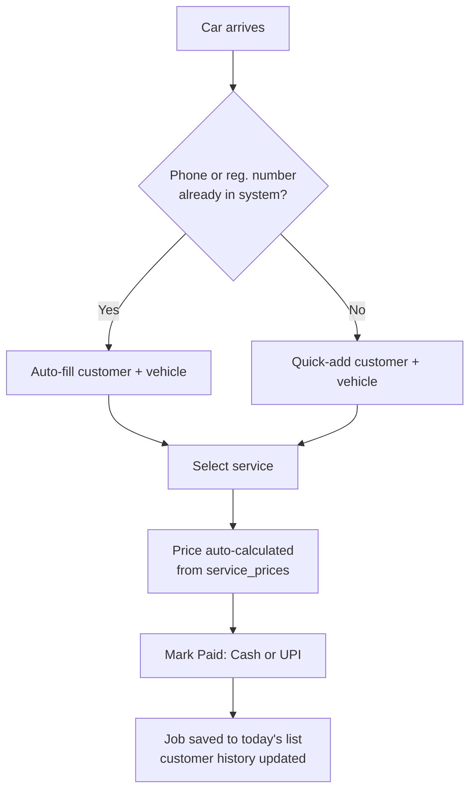
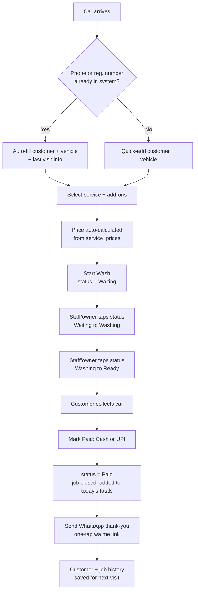
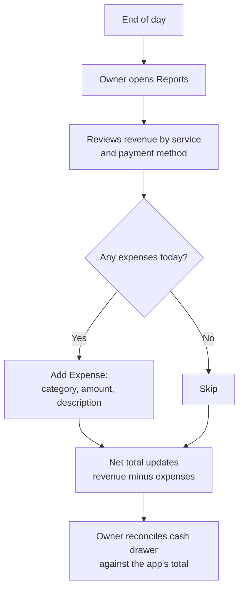
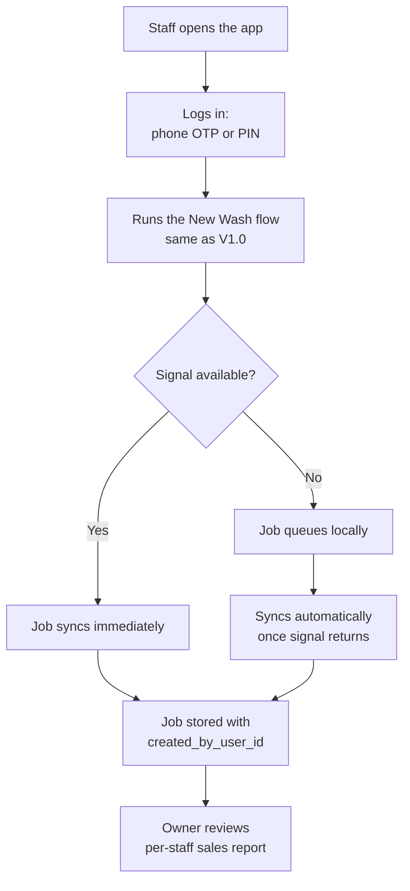
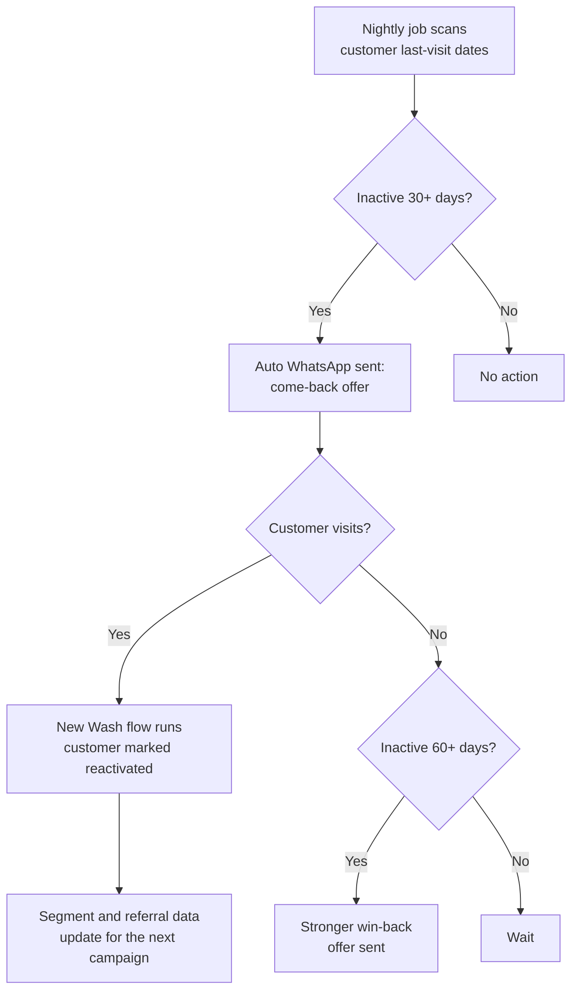
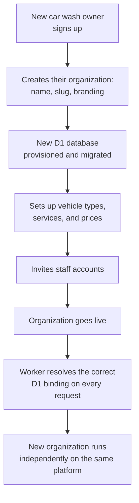

# MANA Wash Manager — App Build Plan

2026-09-22 · @Someone

MANA Wash Manager is built in five versions, each with its own goal, its own feature table, and why it exists. The database and codebase are designed once, professionally, so that adding a new service or price is a data change, and turning MANA into a white-label platform for other car washes later is a matter of switching features on — not a rewrite.

## Version overview

| Version | Name | Goal | Elapsed time |
| --- | --- | --- | --- |
| V0.1 | Paper Replacement | Stop losing customer/job data to a notebook | Week 1 |
| V1.0 | Daily Driver | Run every wash through the app, end to end | Week 2–3 |
| V1.2 | Owner Accountability | Know where the money went, not just what came in | Week 4 |
| V2.0 | Team Ready | Staff can run it without the owner present | Week 6–8 |
| V3.0 | Growth Engine | Turn the customer list into repeat revenue | Month 3–4 |
| V4.0 | White-Label Expansion | Onboard a second car wash onto the same platform | Triggered by real demand, not calendar |

Each version is a real, usable release — not a demo. The gate to the next version is "is this one a stable daily habit," never the calendar.

## Implementation status (as of 2026-10-02, release 0.2.0)

Treat this section as the honest source of truth; every feature table below now has a Status column checked against the code.

| Version | Status |
| --- | --- |
| V0.1 Paper Replacement | ✅ Done |
| V1.0 Daily Driver | ✅ Done |
| V1.2 Owner Accountability | 🟡 Mostly done — expenses, net profit and cash drawer are built; revenue by service, tagged discount reasons and "how did you hear about us" are not |
| V2.0 Team Ready | ✅ Done |
| V3.0 Growth Engine | 🟡 Partly done — referrals and manual reminders/comeback coupons are built; automatic WhatsApp follow-ups, packages and segments are not |
| V4.0 / Multi-shop | 🟡 Mostly done — sign-up, joining a shop, branches, shop isolation, Free and Pro plans, trial expiry and Razorpay subscriptions are built; the Sprixia admin site is not |

**Before the first real shop uses it:** deploy the API and run `set-api-url`, finish WhatsApp codes (Meta test number, `login_code` template, permanent token), and replace the debug signing key.

**Done, verified on a real device** (a USB-connected Android phone, running against the real API and a real Cloudflare D1 database — not a simulator, not mocked):

- Monorepo scaffolded exactly as in Tech stack: `apps/mobile` (React Native CLI, **Android only**), `apps/api` (Cloudflare Worker + Hono), `packages/domain`, `packages/db`
- Prisma schema + hand-written D1 migration SQL, seeded with MANA's real menu — verified by running the actual SQL against real SQLite
- Domain logic (`calculatePrice`, `canTransition`) — 13/13 unit tests passing, strict-mode clean
- API routes: OTP login (dev bypass — see Pending), customer lookup/create/**profile with lifetime stats**, service + vehicle-type list/create, price upsert, job create/list-today/**stats**/update-status/mark-paid, all owner-role-gated where it matters
- **Job creation and status changes return clean 4xx errors for real operator mistakes** (a service with no price set for the selected vehicle type, a discount larger than the subtotal, an already-paid job tapped twice, a job id that no longer exists) instead of a raw 500 — verified via direct API calls for every case
- **"Today"/"this week" boundaries are computed in IST (UTC+5:30), not the Worker's own UTC clock** — a real bug fixed this pass: Cloudflare Workers run in UTC, so a naive `new Date(); setHours(0,0,0,0)` would have misfiled washes done in the first ~5.5 hours of the IST day as "yesterday"
- Mobile screens: **Login**, **New Wash** (Cars/Bikes family switch → lookup → multi-service select, filtered to the vehicle's category → live price → optional discount → submit; customer name is now a required field, not optional), **Job Board** (list, status advance, mark paid, WhatsApp thank-you, auto-refresh on focus), **Settings** (owner-only: separate Cars/Bikes catalogs, each with its own sizes, services, and prices), **Customer Profile** (visit count, lifetime spend, last visit, vehicles, full job history), **Reports** (Today / Last 7 days / This month / This year / Custom dates: revenue, cars washed, pending now, new vs repeat customers, cash/UPI/other split, **PDF export** of the whole report)
- **Vehicle categories (car / bike) shipped past the original V1.0 scope**: `vehicle_types.category` and `services.applies_to` (car/bike/both) now drive which services New Wash and Settings show for a given vehicle family — enforced both client-side (UI never offers a mismatched service) and server-side, verified directly (a car service submitted against a bike vehicle type comes back as a 400 `category_mismatch`, not a silently-accepted row). The local dev database already has a real "Bike" vehicle type created through the app itself (not the seed file), which is on-device evidence the Settings catalog flow works for bikes — a full New Wash walkthrough on a bike job specifically hasn't been re-confirmed by me this pass, though.
- **A same-day production-readiness pass found and fixed three real inconsistencies**, not feature gaps: Job Board's hero "Washes" count was including voided jobs while Reports' "Cars washed" excluded them (same day, two different numbers — now both exclude void); `services.ts`'s price-update route was querying Prisma directly instead of through `serviceRepo`, breaking the build plan's own repository-pattern rule (now routed through `serviceRepo.findById`/`getVehicleType`, and reusing the domain's `serviceAppliesToCategory` helper instead of a second hand-written copy of that check); `SettingsScreen.tsx` had its own `formatRupees` with no thousands separator, so the same price showed as "₹2500" there and "₹2,500" everywhere else (now uses the one shared formatter)
- Full job lifecycle tested repeatedly on-device: Waiting → Washing → Ready → Paid, multi-service pricing verified correct (e.g. Mini SUV Exterior Wash + Tyre Dressing = ₹350 + ₹50 = ₹400)
- Owner settings fully exercised on-device: edited an existing price, added a vehicle type ("Bike"), added a new service ("Ceramic Coating") — the new service correctly showed blank "Set price" cells across all five vehicle types, including the one added moments earlier in the same session
- **Discount flow fully exercised on-device**: entering a discount larger than the subtotal blocks submission with an inline error; entering a discount with no reason blocks submission with a different inline error (the server rejects both independently too — a bare `discount > 0` with no `discountReason` is a 400, matching V1.0's own "discounts require a reason" line); a valid discount + reason submits correctly and the job board shows the discounted total
- **WhatsApp thank-you verified live**: tapping the WhatsApp action on a paid job opens the real WhatsApp app with the correct customer phone number and a pre-filled thank-you message referencing that customer's vehicle
- **Customer Profile verified live**: correct visit count, lifetime spend (paid jobs only), last visit, vehicle list, and full chronological job history for a real customer
- **Reports verified live on-device**: the Today/Last-7-days periods recompute correctly; payment-split bars are proportioned correctly against total revenue; new-vs-repeat customer counts match manual verification against seeded test data. The PDF export was verified on the release build (2 Oct 2026: PDF created and the share sheet opened). The This-month/This-year/Custom-dates periods are verified by tests and direct API calls only — worth one on-device pass before a real month-end report.
- `mana_db` created for real on Cloudflare; local schema applied; the Worker serves real seeded data via `wrangler dev`
- Repo pushed to GitHub: `admin-sprixia/ManaWashManager`, `main` branch
- Real bugs found and fixed during device testing — worth knowing if you touch this code: Gradle's node_modules paths in a monorepo, Metro not resolving `package.json` "exports" (broke Hono's client), Hermes' incomplete `URLSearchParams` (needed a polyfill), the Job Board not refreshing after navigating back to it, a seeded phone number that didn't match what the login screen actually sends, the UTC-vs-IST day-boundary bug above, and (in testing itself, not the app) `adb`'s tap coordinates drifting whenever the screen scrolls or a `LayoutAnimation` reflows the list — fixed by re-reading exact element bounds via `uiautomator dump` before every tap instead of reusing coordinates across screen states

**Pending for V0.1/V1.0 to be fully "done":**

- Going live: the step-by-step is in the README's **Go live** section (two R2 buckets, `JWT_SECRET` + `OWNER_RECOVERY_CODE` secrets, `npm run db:migrate:remote`, `npm run deploy`, `npm run set-api-url`, `npm run build:release`). Until then the Worker only runs locally (`wrangler dev` + `adb reverse`) and the real D1 database is empty
- **Release signing:** the release build is still signed with the shared debug key (`apps/mobile/android/app/build.gradle`). Create a private upload keystore and wire it in before the first Play Store upload or before installing release builds on shop phones — deliberately left for a separate pass
- WhatsApp sign-in codes: the code and template format are ready (Graph API v25.0); waiting on Meta to issue the test number, then the `login_code` template and a permanent system-user token (see README → Go live)
- Automated on-device tests (Maestro) — device testing is still manual (live device + adb); API, isolation and sign-up suites are automated and run in CI
- iOS build — deliberately out of scope per your direction (Android-only; MANA's customer base doesn't use iPhones). No `ios/` folder exists.

**V2.0 — Team Ready: implemented.**

- **Login:** phone + PIN (SMS was dropped in 0.2.0 — see below). PINs are PBKDF2-SHA256 hashes (100k iterations, never returned by the API); obvious PINs like `1111` or `1234` are rejected; 5 wrong tries lock PIN login for 15 minutes. Every request re-checks the user in the database, so turning a staff member off locks them out at once.
- **Roles:** staff can start washes, move jobs along, mark them paid, void unpaid jobs and log expenses. Prices, reports, team and staff report are owner-only, enforced by the API (403) and hidden in the app.
- **Attribution:** each job stores who created it, who marked it paid and who voided it; the board and job detail show names.
- **Offline:** new washes, status changes, payments, voids and expenses queue on the phone and sync when signal returns. Client-generated ids make every replay idempotent. There's a sync banner, a Sync section in More (retry/discard failed items), and optimistic updates on the board.
- **Audit trail:** every job change writes a `job_events` row. Voids and payment-method corrections need a reason. Paid jobs can only be voided or corrected by the owner.
- **Expenses:** anyone can log expenses by category. Staff see only their own. Voiding one keeps the record. Reports show Revenue − Expenses = Net, and so does the PDF.
- **Owner Staff Report:** per-person sales, washes started, cash/UPI/other split, voids and corrections, plus a Corrections feed of every void and payment change with its reason.
- **Verified:** typecheck (domain, db, api, mobile), 25 domain tests, and direct API calls for the full permission matrix, idempotent replays, lockout and deactivation. The offline flow was walked through on the phone on 2 Oct 2026 (start a wash with the server unreachable, then sync).

**Also shipped (early V3 slice):**

- **Reminders:** a bell on the Job Board opens a per-vehicle list. A vehicle shows up as Due 10 days after its last visit and as Win them back after 30. Staff can send a WhatsApp reminder, snooze it for 3 days or dismiss it. A newer visit clears the reminder.
- **Comeback coupons:** only the owner can issue them, for vehicles that haven't been back in 30+ days. Each gives a random 5–10% off, lasts 14 days and works once. It's valid on that vehicle or the same owner's other vehicles, and the owner's phone must match. Redemption needs internet. The claim is atomic, a vehicle can have only one live coupon, it can't be combined with a manual discount, it's cancelled if the vehicle changes owner, and voiding the job gives it back.
- **Customer Profile redesign:** quick actions, lifetime stats, insights and visit history, with "New wash" pre-filling the plate.

**Release 0.2.0 — shop operations (built and verified by typecheck, lint, domain tests and the API suites against local `wrangler dev`, then walked through on the phone with full demo data from `npm run db:seed:demo`):**

- **Login:** everyone signs in day to day with phone + PIN. Staff are PIN only — the owner sets their PINs from Team. The owner proves it's them with a 6-digit **WhatsApp code** (Meta WhatsApp Cloud API, approved authentication template) on first sign-in, a new phone, or a forgotten PIN, then sets their own PIN. Codes last 10 min, allow 5 wrong tries, one resend per 30 s and 5 per hour; they're stored hashed (`login_codes`). The one-time `OWNER_RECOVERY_CODE` Worker secret stays as the emergency fallback if WhatsApp is unreachable; rotate it to use it again. Dev codes (`000000`) only work for requests to localhost, or on the staging Worker while `STAGING_TEST_CODES` is on (until WhatsApp is live). Changing your own phone number needs your PIN.
- **Car-ready prompt:** moving a job to Ready offers a pre-filled WhatsApp "your vehicle is ready" message with the total.
- **Google review link:** the owner sets it once (More → Google review link). It's added to the thank-you message, and left out when not set.
- **Before/after photos:** optional, up to 10 before and 10 after per job (several can be picked from the gallery at once), taken at 1280 px / 70 % quality. They queue offline like everything else and are kept for 90 days. Staff can view photos on today's or board jobs; only the owner can delete.
- **Cash drawer:** set the morning float, see the live expected cash (float + cash taken − cash expenses), count and close. A mismatch needs a note. Only the owner can reopen a closed day, with a reason, and sees the history. Expenses record whether they were paid by cash, UPI or other.
- **Staff commission (selected services only):** the owner sets a fixed ₹ per vehicle size only on services worth rewarding (e.g. rust coating); every other service pays nothing. When such a service is picked on New Wash, "Who got this service?" asks who got the customer to take it (default: whoever enters the wash, up to 3 people, split equally). It's earned once the job is paid. Anyone can change it until then; after payment only the owner can.
- **Who washed (optional record):** when a job moves to Washing, staff can pick who's washing or skip. No money depends on it.
- **Attendance:** the owner marks each person present, half day or absent. Staff Report shows commission, services got, washes done and attendance per person; staff see their own earnings in More.
- **Referrals:** at New Wash, a genuinely new customer (phone and plate both unseen, not a walk-in) can name the customer who referred them. The referrer must have at least one paid wash and can't refer themselves. The new customer gets a random 5–10 % off at once, and it can't be combined with a manual discount or a coupon. When that wash is paid the referrer gets their own random 5–10 % coupon, and voiding the wash takes it back. A referrer holds at most one unused referral reward. Rewards to send appear in Reminders and on the bell until someone sends them on WhatsApp.
- **Go-live plumbing:** the Worker entry is `src/worker.ts`. A nightly cron at 03:00 IST backs up every table page by page to its own `mana-backups` bucket (manifest written last, kept 30 days, restored with `npm run backup:restore`), deletes expired photos in batches, retries leftover photo files and prunes the error log and rate-limit counters. App crashes (queued offline, plus a full-screen "Try again" fallback instead of a white screen) and API errors are logged to D1 and shown to the owner in More → Error log. Release builds read the API address from `src/config/release.json` (set and health-checked by `npm run set-api-url`) and refuse to build with the placeholder.

**Production hardening pass (0.2.0):**

- **Database:** numbered migrations (`apps/api/migrations`, applied with `db:migrate:remote`); there is no remote reset. `db:check` proves `schema.sql` matches the migrations. Shop-first indexes, CHECK rules on money and statuses, append-only audit tables, and a staging environment.
- **Sign-in security:** PIN and code attempts are reserved atomically before checking, so parallel guesses can't beat the 5-try limit; sign-in routes are also rate limited per IP. Changing a PIN needs the current PIN, and setting or resetting a PIN signs out every other phone (`users.session_version` in the token). The session token is kept in the Android keychain.
- **Two phones at once:** start, ready, pay, void and payment corrections are conditional updates — the second phone gets the same result (if it asked for the same thing) or a clear "this job changed" instead of a double payment. Replayed offline uploads return the original photo, expense, stock move or referral instead of deleting it. Stock counts retry if someone else moved the balance.
- **Scale:** request size limits, paged customer history ("Load older visits"), capped reminder lists, chunked offline customer directory, report exports reading only the columns they need.
- **Offline queue:** waits for the saved queue before accepting new items, keeps an unreadable queue aside instead of losing it, backs off on server errors (15 s doubling to 15 min, failing an item after 8 server errors), pauses without failing when the session has ended, and rejects photos whose file is gone.
- **CI:** `.github/workflows/ci.yml` runs version check, typecheck, lint, domain tests, `db:check`, and the isolation and sign-up suites against a fresh local database.
- **Verified:** typecheck, lint, 49 domain tests, `db:check`, isolation 51/51 and sign-up 49/49 on a fresh database, and on the phone: keychain session surviving a restart, mark ready, collect payment, offline start-wash then sync, PIN change with a wrong then right current PIN, and a gallery photo upload. The release build (code shrinking on, arm-only, 34 MB) was then installed and tested over HTTPS: sign-in, session after restart, New Wash vehicle pictures, PDF export and share, photo download and upload.

**Versioning:** release numbering starts at 0.1.0; every app and package shares one `MAJOR.MINOR.PATCH` version (see Naming conventions). The V-numbers above name plan phases, not release versions.

**Also built (not in the original plan):** inventory/stock (items, purchases, usage, counts, low-stock alerts), shop sign-up and join requests, multiple branches per owner with a shop switcher, and the owner's Error log.

**Not started:** automatic WhatsApp follow-ups from the server, wash packages/memberships, customer segments and export, revenue by service, tagged discount reasons, "how did you hear about us", billing and plan enforcement, the Sprixia admin site, Maestro tests, a pre-commit hook.

## Architecture and engineering principles

These are non-negotiable from the very first commit, because retrofitting them onto a live app with real transaction history is far more expensive than building them in now.

| Principle | What it means here |
| --- | --- |
| Strict TypeScript | `strict: true`, `noUncheckedIndexedAccess`, no `any` — every job, price and customer record is a typed object end to end, client to database |
| Single source of truth for types | Database schema (Prisma) generates the types; API layer validates with Zod schemas derived from the same models — the shape is never hand-duplicated in three places |
| Layered architecture | `domain` (business rules: pricing, job status transitions) → `application` (use cases: "start a wash", "mark paid") → `infrastructure` (database, WhatsApp, payments) → `presentation` (mobile app screens). Business rules never import UI code, so the same domain logic can power both the mobile app and a future admin web tool, without duplicating business rules — see "Layered architecture detail" below |
| Repository pattern | All database access goes through typed repository functions (`customerRepo.findByPhone(phone)`) that run against the Worker's currently-bound D1 database, never raw queries scattered through screens — swapping databases or adding caching later touches one file |
| Multi-shop from the foundation | One shared D1 database; every row carries its `shop_id` (see Data model). Every signed-in request gets a database client locked to its shop, and composite foreign keys stop any row pointing at another shop's data. MANA is shop #1. Full plan: `MANA-Multi-Shop-Plan.md` |
| Owner-editable configuration, not hardcoded constants | Services, prices, and vehicle types live in database tables the owner edits from a settings screen, never as constants in code — adding a new service or changing a price is a form submission, not a code deploy |
| Testing from V1 | Domain logic (pricing calculation, discount rules, job status transitions) gets unit tests from the start; these are the rules most likely to have real money riding on a bug |
| Consistent code style | ESLint (typescript-eslint strict + recommended) and Prettier enforced via a pre-commit hook — one style regardless of who touches the code later |

### Layered architecture detail

```text
presentation/   React Native (CLI) screens, React components — renders data, calls application layer
application/    use-cases: startWash(), markPaid(), addExpense() — orchestrates, no SQL, no JSX
domain/         pure business rules: calculatePrice(), canTransition(status) — no I/O, fully unit-testable
infrastructure/ Prisma repositories, WhatsApp client, auth — the only layer that talks to the outside world
```

A rule such as "a job can't go from Waiting straight to Paid" lives in `domain` and is tested in isolation — it doesn't care whether it's called from the mobile app, a future admin panel, or a script.

## Data model

Two design decisions make this schema extensible without ever needing a rewrite:

1. **Every shop's rows carry a `shop_id`, and isolation is enforced structurally.** (This replaced the earlier "one D1 database per organization" idea: Workers can't pick a database at runtime, so that would have meant a separate Worker deployment per shop.) A `shops` table holds each car wash; every other table has `shop_id`. Routes never query the database directly — `requireAuth` hands them a client from `createShopDb` that adds the shop to every read and stamps it on every write, including nested creates. Each parent table has `UNIQUE (shop_id, id)` and every link to it is a composite foreign key, so the database itself refuses a job that points at another shop's customer, vehicle, service or staff member. `apps/api/scripts/isolation-check.mjs` proves it endpoint by endpoint. Uniques are per shop (customer phone, plate, coupon code); a team member's phone is unique platform-wide, which is how sign-in finds the shop.
2. **Services and prices are rows, not columns.** Instead of a `hatchback_price` / `sedan_price` column pair (which breaks the moment MANA adds a new vehicle category or a new service), pricing is a `service_prices` join table. The owner adds a service or a vehicle type from a settings screen — zero code changes, zero migrations.

The table list below is the original core sketch. The real schema — `shops`, `shop_id` on every table, photos, cash days, attendance, referrals, coupons, stock and more — is `apps/api/schema.sql`.

```text
users
  id, name, phone, role (owner/staff), created_at

vehicle_types
  id, name ("Hatchback", "Sedan", …), category (car | bike), sort_order
  → owner-editable list, not an enum baked into code; category keeps car and bike sizes
    in separate lists everywhere (New Wash's vehicle picker, Settings' catalog editor)

services
  id, name, description, active, applies_to (car | bike | both), sort_order
  → applies_to is what actually filters New Wash's service list to the selected
    vehicle's category — enforced again server-side on job creation, not just in the UI

service_prices
  id, service_id, vehicle_type_id, price
  → the actual price matrix; adding a service or vehicle type auto-creates blank cells here for the owner to fill in

customers
  id, name, phone (unique), source (google/friend/board/instagram/other),
  marketing_consent, created_at

vehicles
  id, customer_id, registration_number (unique), make, model, vehicle_type_id

jobs
  id, customer_id, vehicle_id, created_by_user_id, status
  (waiting/washing/ready/paid/void), subtotal, discount, discount_reason,
  total, payment_method (cash/upi/other), payment_status, created_at, completed_at

job_services
  job_id, service_id, price_at_time, quantity
  → price is COPIED onto the job at creation time, so a later price change never rewrites historical revenue

expenses          -- from V1.2
  id, category, amount, description, date, created_by_user_id
```

Why `price_at_time` on `job_services` instead of always joining to the live price: a wash charged ₹500 in March must still show ₹500 in March's reports even after the owner raises prices in April. This single decision is what makes historical reporting trustworthy as prices change over time — a detail that's easy to miss and expensive to fix after the fact.

## V0.1 — Paper Replacement

**Goal:** replace the notebook/memory-based job tracking with something that never loses a customer's phone number or a car's service history.

**Why:** this is the smallest possible slice that is still safe to run on real customers on day one, and it proves the core data model (organizations → customers → vehicles → jobs) before anything else is built on top of it.

| Feature | Description | Priority | Status |
| --- | --- | --- | --- |
| New job entry | Phone or reg. number lookup → auto-fill existing customer, or quick-add a new one | Must have | ✅ Done |
| Service picker | Select from the owner's current service list, price auto-fills from `service_prices` | Must have | ✅ Done |
| Mark paid | Cash or UPI, total shown before confirming | Must have | ✅ Done |
| Job list (today) | Flat list of today's jobs — no status board yet, that's V1.0 | Must have | ✅ Done (superseded by V1.0's status board, also done) |
| Owner settings: services & prices | Add/edit a service, add/edit a vehicle type, set prices — built now because V0.1 has nothing to seed it with otherwise | Must have | ✅ Done — editing prices, adding a vehicle type, and adding a service are all tested on-device |

### Final flow of V0.1


```mermaid
flowchart TD
    A[Car arrives] --> B{Phone or reg. number\nalready in system?}
    B -- Yes --> C[Auto-fill customer + vehicle]
    B -- No --> D[Quick-add customer + vehicle]
    C --> E[Select service]
    D --> E
    E --> F[Price auto-calculated\nfrom service_prices]
    F --> G[Mark Paid: Cash or UPI]
    G --> H[Job saved to today's list\ncustomer history updated]
```

| Step | Who | Action | Screen |
| --- | --- | --- | --- |
| 1 | Owner | Enter the customer's phone or the car's registration number | New Job |
| 2 | App | Existing customer → auto-fill; new → quick-add form | New Job |
| 3 | Owner | Select the service | New Job |
| 4 | App | Price calculated automatically from the current price list | New Job |
| 5 | Owner | Collect payment, mark Cash or UPI | New Job |
| 6 | App | Job saved, added to today's list and the customer's history | Today's Jobs |

No status board yet — that's what V1.0 adds on top of this same core flow.

## V1.0 — Daily Driver

**Goal:** every wash at MANA, from car arrival to WhatsApp thank-you, runs through the app — nothing happens on paper.

**Why:** V0.1 proved the data model; V1.0 makes the app the actual system of record, with live job status so the owner (or a customer waiting) can see where every car is right now.

### Feature table

| Feature | Description | Priority | Status |
| --- | --- | --- | --- |
| Today dashboard | Cars washed, revenue, cash vs UPI split, pending jobs | Must have | ✅ Done — Reports screen, "Today" period; verified on-device |
| Job status board | Waiting → Washing → Ready → Paid, tap to advance | Must have | ✅ Done — full lifecycle tested on-device |
| Customer profile | Visit count, lifetime spend, last visit, full service history | Must have | ✅ Done — new screen, reached by tapping a job's customer row; verified on-device |
| WhatsApp thank-you | Pre-filled `wa.me` link, one tap to send after a job completes | Must have | ✅ Done — verified live: opens WhatsApp with the correct number and message |
| Basic reports | Today / this week: cars, revenue, cash vs UPI, new vs repeat | Should have | ✅ Done, and grew past the original scope — Reports now has 5 periods (Today, Last 7 days, This month, This year, Custom From→To dates) plus a **PDF export** (summary, payment split, full job ledger) shared via the native share sheet. "Last 7 days" is a rolling range rather than a Mon–Sun calendar week, to sidestep week-boundary ambiguity. |
| Add-ons and discounts | Add-on services on top of the main wash; discounts require a reason | Should have | ✅ Done — discount entry in New Wash, validated client-side and server-side (amount can't exceed subtotal, reason required when discount > 0); verified on-device |
| *(beyond original scope)* Car/bike catalogs | Vehicle types and services are now categorized `car` \| `bike` \| `both`; New Wash only shows the matching menu for the selected vehicle family | — | ✅ Done — filtered client-side and re-checked server-side on job creation (a mismatched service/vehicle pairing is rejected with a 400, not silently accepted) |

### Final flow of V1.0


```mermaid
flowchart TD
    A[Car arrives] --> B{Phone or reg. number\nalready in system?}
    B -- Yes --> C[Auto-fill customer + vehicle\n+ last visit info]
    B -- No --> D[Quick-add customer + vehicle]
    C --> E[Select service + add-ons]
    D --> E
    E --> F[Price auto-calculated\nfrom service_prices]
    F --> G[Start Wash\nstatus = Waiting]
    G --> H[Staff/owner taps status\nWaiting to Washing]
    H --> I[Staff/owner taps status\nWashing to Ready]
    I --> J[Customer collects car]
    J --> K[Mark Paid: Cash or UPI]
    K --> L[status = Paid\njob closed, added to today's totals]
    L --> M[Send WhatsApp thank-you\none-tap wa.me link]
    M --> N[Customer + job history\nsaved for next visit]
```

| Step | Who | Action | Screen |
| --- | --- | --- | --- |
| 1 | Owner/staff | Enter the customer's phone or the car's registration number | New Wash |
| 2 | App | Existing customer → auto-fill name, vehicle, visit count, last visit; new → quick-add form | New Wash |
| 3 | Owner/staff | Pick service(s) and any add-ons | New Wash |
| 4 | App | Price calculated automatically from the current price list | New Wash |
| 5 | Owner/staff | Tap Start Wash | Job Board (status: Waiting) |
| 6 | Owner/staff | Advance status as work happens | Job Board (Washing → Ready) |
| 7 | Owner/staff | Collect payment, tap Cash or UPI | Payment |
| 8 | App | Job closes, totals update on the dashboard | Dashboard |
| 9 | Owner/staff | Tap Send WhatsApp — pre-filled thank-you message opens | Customer Profile |
| 10 | App | Full visit is saved to that customer's history for next time | Customer Profile |

The design bar for V1.0: a returning customer should never require typing more than a phone number or a registration number.

## V1.2 — Owner Accountability

**Goal:** the app tells the owner exactly where money came from and where it went, every single day, without any manual reconciliation.

**Why:** once V1.0 is the system of record for revenue, the natural next question is cost — without it, "is this business profitable" still requires a separate notebook.

| Feature | Description | Priority | Status |
| --- | --- | --- | --- |
| Expense log | Category (chemicals/labour/electricity/water/maintenance/other), amount, description, date | Must have | ✅ Done — same six categories, plus paid by cash/UPI/other and an optional bill photo; staff see only their own |
| Daily/weekly reports | Revenue, expenses, net, by service, by payment method | Must have | 🟡 Mostly — revenue, expenses, net profit and cash/UPI/other split are in Reports and the PDF; **revenue by service is not built** |
| Discount reason tracking | Every discount is tagged (first wash / referral / owner / other) — rolls up into a report | Should have | 🟡 Partly — every discount needs a typed reason, shown per job in the PDF, and Reports shows total discounts; there are no fixed tags and no roll-up by reason. Referral and comeback discounts are tracked separately |
| "How did you hear about us" | One field on new customers, rolls up into a monthly channel report | Should have | ❌ Not built — `customers.source` exists in the database, but New Wash doesn't ask and no report uses it |
| *(beyond plan)* Cash drawer | Morning float, live expected cash, count and close, mismatch note, owner reopen | — | ✅ Done — covers step 5 of the flow below |

### Final flow of V1.2


```mermaid
flowchart TD
    A[End of day] --> B[Owner opens Reports]
    B --> C[Reviews revenue by service\nand payment method]
    C --> D{Any expenses today?}
    D -- Yes --> E[Add Expense:\ncategory, amount, description]
    D -- No --> F[Skip]
    E --> G[Net total updates\nrevenue minus expenses]
    F --> G
    G --> H[Owner reconciles cash drawer\nagainst the app's total]
```

| Step | Who | Action | Screen |
| --- | --- | --- | --- |
| 1 | Owner | Opens Reports at the end of the day | Reports |
| 2 | App | Shows revenue by service, payment method, and discounts given | Reports |
| 3 | Owner/staff | Logs any expenses incurred that day | Add Expense |
| 4 | App | Recalculates net total (revenue minus expenses) | Reports |
| 5 | Owner | Matches the physical cash drawer against the app's cash total | Reports |

This is a daily habit layered on top of V1.0's job flow, not a separate app section.

## V2.0 — Team Ready

**Goal:** MANA runs correctly whether or not the owner is physically present.

**Why:** the `users` table and `role` field already exist in the schema from V0.1 — this version is mostly UI and permission checks on top of data that was designed in from day one, not a schema migration.

| Feature | Description | Priority | Status |
| --- | --- | --- | --- |
| Staff login | Phone-number OTP or PIN, no password to remember | Must have | ✅ Done — phone + PIN; staff can also request to join a shop with its 6-digit ID |
| Roles | Owner (full access, pricing, reports) vs Staff (create/update jobs, mark paid, no pricing or reports) | Must have | ✅ Done — enforced by the API (403) and hidden in the app |
| Per-staff attribution | Every job records who created it and who marked it paid | Must have | ✅ Done — plus who voided it, who washed it and who sold commission services |
| Offline queueing | Jobs and status updates queue locally and sync when signal returns | Should have | ✅ Done — verified on the phone |
| Edit/void with audit trail | Corrections keep a record of who changed what and why, so cash always reconciles | Must have | ✅ Done — append-only `job_events`, reasons required, Staff Report corrections feed |
| Staff expense entry | Chemical purchases etc. logged on the spot | Should have | ✅ Done |

### Final flow of V2.0


```mermaid
flowchart TD
    A[Staff opens the app] --> B[Logs in:\nphone OTP or PIN]
    B --> C[Runs the New Wash flow\nsame as V1.0]
    C --> D{Signal available?}
    D -- Yes --> E[Job syncs immediately]
    D -- No --> F[Job queues locally]
    F --> G[Syncs automatically\nonce signal returns]
    E --> H[Job stored with\ncreated_by_user_id]
    G --> H
    H --> I[Owner reviews\nper-staff sales report]
```

| Step | Who | Action | Screen |
| --- | --- | --- | --- |
| 1 | Staff | Logs in with phone OTP or a PIN | Login |
| 2 | Staff | Runs the New Wash flow exactly as in V1.0 | New Wash |
| 3 | App | If offline, the job queues locally | Job Board |
| 4 | App | Syncs automatically once signal returns | Job Board |
| 5 | App | Every job is stamped with who created and who closed it | Job Board |
| 6 | Owner | Reviews per-staff sales and any edit/void history | Staff Report |

Staff never see pricing controls or full reports — those stay Owner-only, enforced by the `role` field.

## V3.0 — Growth Engine

**Goal:** the customer list actively drives repeat visits instead of sitting idle in the database.

**Why:** by this point there are months of real V1/V2 usage data — enough to segment customers by actual behavior instead of guessing, and enough visit volume to justify the WhatsApp Business API's setup cost.

| Feature | Description | Priority | Status |
| --- | --- | --- | --- |
| Automated WhatsApp follow-ups | Via WhatsApp Business Cloud API: thank-you + review request, 30-day inactive nudge, 60-day win-back offer | Must have | 🟡 Manual version done — thank-you with Google review link, ready prompt, and a Reminders list (Due at 10 days, Win back at 30) that staff send with one tap via `wa.me`, plus owner comeback coupons. **Automatic sending from the server is not built** (needs approved marketing templates) |
| Membership/package tracking | Sell a 4-wash package, track redemptions, alert before expiry | Should have | ❌ Not built |
| Customer segments | Auto-generated lists: first-time, 5+ visits, inactive 30/60 days — exportable for campaigns | Should have | ❌ Not built — only the Reminders "Due" and "Win back" lists exist; no first-time/5+ lists, no export |
| Referral tracking | Link a referred customer's first visit to the referrer, auto-apply both discounts | Should have | ✅ Done — new customer gets 5–10 % off at once; referrer gets a coupon when that wash is paid; voiding takes it back |
| Source attribution report | Monthly channel report from the V1.2 "how did you hear about us" field | Nice to have | ❌ Not built (depends on the V1.2 field) |

### Final flow of V3.0


```mermaid
flowchart TD
    A[Nightly job scans\ncustomer last-visit dates] --> B{Inactive 30+ days?}
    B -- Yes --> C[Auto WhatsApp sent:\ncome-back offer]
    B -- No --> D[No action]
    C --> E{Customer visits?}
    E -- Yes --> F[New Wash flow runs\ncustomer marked reactivated]
    E -- No --> G{Inactive 60+ days?}
    G -- Yes --> H[Stronger win-back\noffer sent]
    G -- No --> I[Wait]
    F --> J[Segment and referral data\nupdate for the next campaign]
```

| Step | Who | Action | Trigger |
| --- | --- | --- | --- |
| 1 | System | Nightly scan of every customer's last-visit date | Scheduled job |
| 2 | System | 30+ days inactive → sends a come-back WhatsApp template | WhatsApp Business API |
| 3 | Customer | Books a wash, or doesn't | — |
| 4 | System | Still inactive at 60+ days → sends a stronger win-back offer | WhatsApp Business API |
| 5 | Owner | Reviews segment response rates | Reports |
| 6 | System | Referral and membership status update automatically as visits happen | Customer Profile |

This flow runs in the background — the owner sees the results in Reports, not a manual send button.

## V4.0 — White-Label Expansion

> **Superseded by `MANA-Multi-Shop-Plan.md`.** Multi-shop is now built into the foundation (shared database, `shop_id` on every row) rather than one database per organization. The rest of this section is kept for history.

**Goal:** onboard a second car wash (a franchisee, a partner, or a paying customer of the platform) without touching MANA's live data or rewriting the schema.

**Why now and not sooner:** every organization has run in its own D1 database since V0.1, specifically so this version is additive — a new database and a Worker route, not a migration of MANA's live data. Building the multi-tenant UI before there's a second real tenant would mean guessing at requirements no actual customer has stated yet.

| Feature | Description | Priority | Status (multi-shop design) |
| --- | --- | --- | --- |
| Organization onboarding | Sign-up flow that provisions a new D1 database, seeds its vehicle types/services/prices, and creates the first owner account | Must have | ✅ Done as "Start a new shop" (WhatsApp code → PIN → name, shop, city); the owner then adds their own menu. No new database needed |
| Org-scoped auth | Each login's JWT carries which organization (and D1 database) it belongs to; the Worker binds every subsequent query to that database | Must have | ✅ Done — token carries `shopId`; every query goes through the shop-scoped client; proven by the isolation suite |
| Per-organization branding | Logo, business name, and colors shown on that org's screens and WhatsApp messages | Should have | 🟡 Shop name only — shown in the app and WhatsApp messages; no logo or colors |
| Database provisioning automation | A script/Worker that creates and migrates a new D1 database per organization at onboarding, so isolation never depends on a hand-written policy | Must have | ✅ Not needed — one shared database with `shop_id`, composite foreign keys and migrations |
| Platform billing | Subscription or per-wash fee charged to each organization | Should have | ✅ Built — Free and Pro plans, 14-day trial, Razorpay subscriptions (UPI AutoPay), founder price; see Pricing and plans |
| Platform-level dashboard | Cross-organization view for MANA-as-platform-operator only (queries across all D1 databases) | Nice to have | ❌ Not built (planned as the separate Sprixia admin site) |

This version is deliberately last: it's the one whose requirements depend entirely on who the second customer turns out to be, so it stays unscoped in detail until that's a real conversation, not a hypothetical one.

### Final flow of V4.0


```mermaid
flowchart TD
    A[New car wash owner\nsigns up] --> B[Creates their organization:\nname, slug, branding]
    B --> C[New D1 database\nprovisioned and migrated]
    C --> D[Sets up vehicle types,\nservices, and prices]
    D --> E[Invites staff accounts]
    E --> F[Organization goes live]
    F --> G[Worker resolves the correct\nD1 binding on every request]
    G --> H[New organization runs\nindependently on the same platform]
```

| Step | Who | Action | Screen |
| --- | --- | --- | --- |
| 1 | New owner | Signs up and creates their organization | Onboarding |
| 2 | Platform | Provisions and migrates a new D1 database for that organization | — |
| 3 | New owner | Sets vehicle types, services, prices, and branding | Org Settings |
| 4 | New owner | Invites their own staff accounts | Org Settings |
| 5 | Platform | Organization goes live; every request is bound to its own D1 database | — |
| 6 | New owner's staff | Run the exact same New Wash → Job Board → Payment flow as MANA does | New Wash, Job Board, Payment |

Every screen a new organization's staff sees is the same app MANA already runs — only the data, branding, and prices differ.

## Tech stack

| Layer | Choice | Why |
| --- | --- | --- |
| Language | TypeScript, `strict: true` everywhere | Type safety end to end; catches pricing/schema mistakes at compile time, not in production |
| Mobile app framework | React Native CLI (TypeScript, bare workflow) | A real, installable app for iOS and Android from one codebase, with full control over native modules and build configuration — not a website, not a browser tab |
| API layer | tRPC or Hono RPC — both typed, both run on Workers with Hono as the HTTP layer | Client and server share exact types — an API change that breaks the app fails at build time |
| Database | Cloudflare D1 (SQLite) — `mana_db`, shared by every shop, rows stamped with `shop_id` | Runs at the edge next to the Worker for very low query latency; one database means instant sign-up, one schema and one deploy, with isolation enforced by the shop-scoped client and composite foreign keys |
| ORM / data access | Prisma + `@prisma/adapter-d1` + a repository layer on top | Typed queries against D1; a Prisma client extension (`createShopDb`) scopes every query to the signed-in shop, so no repository can reach another shop's rows |
| Auth | Phone + PIN checked by the Worker, which issues a JWT session signed with the `JWT_SECRET` Worker secret. The owner's first sign-in (and a lost PIN) uses a WhatsApp code; the one-time `OWNER_RECOVERY_CODE` secret is the emergency fallback | Nothing for staff to forget beyond a PIN, the owner can recover without touching the server, WhatsApp is cheaper and more reliable than SMS in India, and no auth-provider SDK lock-in on bare React Native CLI |
| Backend hosting | Cloudflare Workers (Hono as the router) for the API — `mana-api` — with a `DB` binding to that organization's D1 database | Edge compute with no cold starts comparable to serverless containers, a generous free tier, and pricing that stays cheap as more organizations (V4) are added |
| App distribution | Native build tooling: Xcode + Fastlane for iOS, Android Studio + Gradle for Android; react-native-code-push (App Center) for OTA JS-only updates between store releases | Full control over native build configuration and any native modules needed later; OTA updates still possible for JS-only fixes without waiting on store review |
| Messaging | `wa.me` links (V1) → WhatsApp Business Cloud API (V3) | Zero setup to start, graduates only once volume justifies the integration |
| Testing | Vitest for domain/unit tests (Worker logic tested via Miniflare), Maestro for critical mobile flows (new wash → paid) from V1.0 | Confidence to change code without manually re-testing every release |
| Linting/formatting | ESLint (typescript-eslint strict) + Prettier, enforced in a pre-commit hook and CI | Consistent code regardless of who writes it, including future contributors |
| Monorepo-ready structure | `apps/mobile`, `apps/api` (the Worker), `packages/domain`, `packages/db` — exact package names in Naming conventions below | A future admin tool or second app can import `domain`/`db` packages without duplicating logic |

**What was actually used (Oct 2026):** Hono RPC (not tRPC); Android only (no iOS, Fastlane or CodePush); Vitest plus the API suites in `apps/api/scripts` run by GitHub Actions CI; no Maestro tests and no pre-commit hook yet (Prettier is set up as `npm run format`).

Development itself is free — Cloudflare's free tier (Workers, D1, R2) covers the backend at MANA's current scale. Costs to plan for: a one-time \~$25 Google Play Developer fee, and a small Meta fee per WhatsApp sign-in code.

## Pricing and plans

Decided 2026-10-02. **Built (Unreleased, after 0.3.0):** Free and Pro with limits, the 14-day trial, Razorpay subscriptions in Test Mode, the founder price (₹399) and the branch price (₹349). Business, add-ons and message packs are not built (see "Adding features later").

### Principles

- **Price per shop**, never per staff member. Owners hate paying more for every washer.
- **Keep it simple:** launch with two plans only, Free and Pro.
- **Sell the outcome, not the software:** "Stop cash leaking and bring customers back."

### What shop owners pay for

| Value | Built feature that delivers it |
| --- | --- |
| Stop cash leakage — staff can't wash for cash and skip the record | Cash drawer, audit trail, staff PINs, void tracking |
| Get customers back | Reminders (Due at 10 days, Win back at 30), comeback coupons, referrals |
| Know the numbers | Today's takings, net profit after expenses, staff performance |
| Run the team | Attendance, commission, who washed which car |

If the app catches one hidden ₹300 wash a week, it has paid for itself.

### Plans

| | Starter (Free) | Pro | Business (later) |
| --- | --- | --- | --- |
| **Price** | ₹0 forever | ₹499 / month or ₹4,999 / year | ₹999 / month or ₹9,999 / year, per shop |
| **Shops** | 1 | 1 (extra branch +₹349 / month) | Multiple branches with the shop switcher |
| **Team** | Owner + 1 staff | Up to 5 staff | Unlimited staff |
| **Washes** | Up to 300 / month (about 10 a day) | Unlimited | Unlimited |
| **Job board, new wash, payments** | ✅ | ✅ | ✅ |
| **Reports** | Today and this week | Full reports, PDF export, expenses and net profit | Same as Pro, plus data export |
| **Reminders, coupons, referrals** | — | ✅ | ✅ |
| **Before/after photos** | — | ✅ | ✅ |
| **Cash drawer, commission, attendance, inventory** | — | ✅ | ✅ |
| **WhatsApp** | Tap-to-send (`wa.me`) | Tap-to-send (`wa.me`) | Automatic from the shop's own number (Meta charges paid by the shop) |
| **Branding and support** | — | — | Shop logo on PDFs and messages, priority phone support |
| **Who it's for** | Very small shops trying it with zero risk | Most shops — the plan to push | Multi-branch or high-volume owners |

**All prices (built, decided 2026-10-02):**

| Who | Monthly | Yearly | Off ₹499 |
| --- | --- | --- | --- |
| Regular Pro (shop 51 onwards) | ₹499 | ₹4,999 | — |
| Founder (first 50 shops to pay, for life) | ₹399 | ₹3,990 | 20% |
| Extra branch (another of the owner's shops is on paid Pro) | ₹349 | ₹3,490 | 30% |

The branch price sits below the founder price on purpose: a second shop is always the cheapest way to grow, and a founder's own branch gets ₹349 too. A shop always gets the cheapest price it qualifies for.

**Add-ons (later):** WhatsApp message packs if Sprixia resells Meta messages (for example 1,000 messages for ₹199).

### Adding features later: Pro, add-on or a new plan?

Decided 2026-10-02. Every new feature (booking slots, loyalty points and so on) goes through these three questions, in order:

1. **Does it cost almost nothing to run?** Put it **in Pro** at the same price. This is the default. It keeps the choice simple ("Free or Pro"), gives existing Pro shops more for their money so fewer cancel, and the server cost per shop stays around ₹6 a month. If Pro gets much better, raise the price for **new** shops only (for example ₹599) and keep existing subscriptions on their price.
2. **Does every use cost Sprixia money?** For example WhatsApp or SMS messages to customers (about ₹0.13–0.80 each). Make it **metered**: a monthly allowance inside Pro (for example 200 messages), plus top-up packs or a small add-on (for example ₹149 a month). Never unlimited inside a flat price, or one busy shop can cost more than it pays.
3. **Is it big, and only wanted by large or multi-branch shops?** It goes in **Business** (about ₹999 / month), but only once there are **at least three** such features. Before that, put it in Pro. A third plan for a single feature just confuses owners.

**Booking slots, worked through:**

| Part | Where it goes | Why |
| --- | --- | --- |
| Booking calendar inside the app (the shop adds bookings, sees the day's slots) | Pro | Costs nothing to run |
| Public booking link customers use themselves | Pro at first; Business once Business exists | Big feature, mostly for busy shops |
| WhatsApp confirmation and reminder to the customer | Metered: allowance in Pro, then packs | Each message costs money |

**How it's built today, and what changes when add-ons arrive:**

- Today a Pro feature is one entry in `ProFeature` in `packages/domain/src/plans.ts`, checked by `requirePro('feature')` on the server and `usePlan()` (PRO pill, upgrade sheet) in the app. A new Pro feature = one line there + the lock on its screen + a gate check in `npm run test:plans`.
- **Don't build the add-on system until the first add-on is real.** When it is: an `entitlements` table (shop, add-on, quantity, paid until), filled by its own Razorpay subscription through the same webhook; `requirePro` becomes "the plan includes it **or** the shop bought it"; message allowances are counted per IST month the way Free's wash limit is.
- **Business, when built:** a third tier in `PlanTier` and `PLAN_LIMITS`, its own prices, and `requirePlan('business', feature)` next to `requirePro`.

### Launch tactics

1. **Founder price:** the first 50 shops get Pro at **₹399 / month (₹3,990 / year), locked for life**.
2. **14-day free trial of Pro** on sign-up (already built as the shop trial). Afterwards the shop drops to Free unless it pays. Nothing is deleted.
3. **Yearly plan = 2 months free.** Owners like paying once a year (after Diwali or at the new financial year).
4. **UPI AutoPay** through Razorpay or Cashfree subscriptions. Cards are rare among small shop owners.
5. **Show the value in the app**, for example "This month MANA brought back 23 customers worth ₹6,900" on Reports, so renewing feels obvious.
6. **Start with Free and Pro only.** Add Business when multi-branch customers ask for it.

### Why the prices work

- **For the shop:** 30 washes a day at ₹300 is about ₹2.7 lakh a month. ₹499 is about 0.2% of that — less than one wash a day.
- **Against alternatives:** general billing apps (Vyapar, myBillBook) cost ₹2,500–4,000 a year and aren't built for car washes.
- **For Sprixia:** server costs stay around 1% of revenue (estimate below). The real costs are payment fees (about 2% plus GST per payment), GST on the price (18%, either "₹499 + GST" or included) and support time.

### Server cost estimate (Cloudflare, at about ₹88 per US dollar)

The app keeps storage in check: photos are resized to 1280 px at 70% quality (about 200 KB each, at most 1.5 MB accepted), purged after 90 days (`PHOTO_RETENTION_DAYS`), and nightly backups are kept 30 days. Storage levels off instead of growing forever, and R2 has no download fees.

| Shops | Cloudflare cost per month | Revenue per month at ₹499 |
| --- | --- | --- |
| 1 busy shop (30 washes a day, photos on every wash) | About ₹2–3 | ₹499 |
| 10 | ₹0 (free tier) | About ₹5,000 |
| 100 | About ₹450–600 (mostly the $5 Workers Paid plan) | About ₹50,000 |
| 1,000 | About ₹5,000–6,000 | About ₹5 lakh |

**To watch:**

- **Database size:** one D1 database holds up to 10 GB. That's years away at 100 shops, and about 1–2 years at 1,000 busy shops. The fix is archiving old years or splitting shops across a few databases.
- **Free-plan abuse:** photos stay paid-only and Free has a wash limit, so a free shop costs under ₹1 a month.
- **Safety net:** set a Cloudflare budget alert (**Billing → Add Budget Alert**) at about $6 (₹500) a month.

### How it's built

- **Rules live in one place:** `packages/domain/src/plans.ts` (limits, prices, the Pro feature list and `planStatus`). The shop's tier is worked out from dates on every request, so no job has to flip anything at midnight:
  - **Pro** while `paid_until` is in the future.
  - **Grace** for 3 days after a failed renewal (subscription `active` or `past_due`); a cancelled plan gets no grace.
  - **Trial** while `trial_ends_at` is in the future.
  - Otherwise **Free**. Nothing is ever deleted.
- **The server enforces every rule** (HTTP 402 with `plan_required`, `plan_wash_limit` or `plan_staff_limit`); the app only mirrors them so owners see a PRO pill or the upgrade sheet before they tap.
  - **Staff seats:** owner + 1 on Free, owner + 5 on Pro. Seats go to owners first, then the longest-serving staff. Staff past the limit can't sign in (403 `plan_seat_locked`, which also ends an open session) until the shop upgrades. Making locked staff an owner is blocked.
  - **Washes:** 300 non-void washes per IST calendar month on Free. A wash entered live past the limit is refused; one recorded offline (more than 2 minutes before it reached the server) still syncs, up to 25 extra. Finishing and taking payment for washes already started always works.
  - **Reports:** Free sees today and the last 7 days; longer ranges, PDF export, expenses, staff report and the audit trail are Pro.
  - **Pro-only features:** photos, reminders, coupons, referrals, cash drawer, commission, attendance and inventory. On Free, commission isn't paid on new washes.
  - **More branches:** opening another shop needs one of the owner's shops on paid Pro (a trial doesn't count). The new branch starts on Free with its own plan and no second trial, so branches can't be used to keep restarting trials. Each branch has its own Pro subscription and bill.
- **Branch price:** a shop gets ₹349 / month or ₹3,490 / year while the same owner (same phone, owner role) has **another** shop on paid Pro — a trial doesn't count (`priceKindFor` in `plans.ts`, `ownsOtherPaidProShop` in `apps/api/src/lib/plan.ts`). `priceKindFor` picks the cheapest price that applies; a branch never takes a founder slot, so the 50 slots go to new owners. The price is fixed when the branch subscribes and stays for that subscription; subscribing again checks again. Razorpay plans are named "branch price" so the owner's statement is clear.
- **Payments (Razorpay, REST API, no SDK):** `POST /billing/subscribe` creates a subscription and returns Razorpay's hosted page (UPI AutoPay or card). Upgrading during the trial or a paid period keeps those days; the first charge is on the day they end. `POST /billing/webhook` checks the HMAC signature, ignores repeat deliveries (`billing_events`), re-reads the subscription from Razorpay and applies it; `paid_until` only ever moves forward, so out-of-order webhooks are harmless. The app also calls `POST /billing/sync` when the owner returns from paying, and the nightly job catches up any shop whose renewal webhook went missing. Cancelling stops renewals at once; Pro stays on until `paid_until`.
- **Founder price:** the first 50 shops to pay get ₹399 / month or ₹3,990 / year **for life** — Razorpay renews at the subscription's own price, so every renewal stays ₹399, and a founder who cancels and comes back gets it again. Shop 51 onwards is offered ₹499 automatically. Counted on the server:
  - **Taken slots** = shops with `founder_at` (paid the founder price at least once) **plus** shops holding a slot (`founder_hold_until` in the future).
  - **Hold:** taken at checkout for 48 hours (the checkout link's life). When AutoPay is approved with the first charge later (end of the trial), it's extended to that date + 3 days of retries. It's given back at once if the checkout is cancelled before any payment, and simply lapses if the shop never pays.
  - **Last-slot race:** each claim is stamped (`founder_hold_at`) and only counts claims ahead of it (`founderSlotsAhead` in `plans.ts`): paid founders plus live holds stamped earlier, same millisecond broken by shop id. So when several owners grab the last slot at once, exactly one gets ₹399 and the rest are charged ₹499 — never two, never none. If the phone showed ₹399 but the spot went meanwhile, the app says so and asks before opening the payment page.
- **Never charged twice:**
  - Two upgrade taps (or two phones) at once: the subscription is attached with a compare-and-swap on `shops.subscription_id`; the loser cancels its own Razorpay subscription at once and returns 409 `checkout_in_progress`, so only one payment link is ever open.
  - Starting again later cancels the old unpaid link first.
  - If a second subscription still goes live while the shop's own one is running (an old link that couldn't be cancelled), the webhook cancels it, refunds its charge in full, leaves it out of the payment history and alerts Sprixia.
- **Accepted limits (bounded, self-correcting):** two washes started at the very same moment at #300 can both go through (at most a few over; the offline cushion is 25 anyway); two staff approved at the same moment on Free briefly exceed the seat count, and the seat order then locks the newest one; a refund made by hand in Razorpay doesn't shorten `paid_until` (Pro runs to the end of that period).
- **Same rules for every shop**, MANA included — no free-forever switch.
- **Tests:** `packages/domain` unit tests for `planStatus` and prices; `npm run test:plans` (in CI) checks every limit, the trial, grace, cancellation and the webhook signature against the real API.

## Naming conventions

Established once here so every Worker, database, secret, table, and function is named the same way everywhere it's used — in this document and later in the code.

| What | Convention | MANA's actual names |
| --- | --- | --- |
| Cloudflare Worker (API) | `{org-slug}-api`, kebab-case | `mana-api` (staging: `mana-api-staging`) |
| D1 database | `{org_slug}_db`, snake_case | `mana_db` |
| D1 binding (in Worker code) | Always `DB`; routes use `c.get('db')` (shop-scoped), never the binding directly | `env.DB` |
| Worker secrets (`wrangler secret put`) | SCREAMING_SNAKE_CASE | `JWT_SECRET`, `OWNER_RECOVERY_CODE`, `WHATSAPP_API_TOKEN`, `WHATSAPP_PHONE_NUMBER_ID` |
| JWT claims | lowerCamelCase custom claims, alongside standard `sub` / `iat` / `exp` | `sub` (user id), `shopId`, `role`, `phone` |
| Database tables | plural, snake_case | `users`, `vehicle_types`, `service_prices`, `jobs`, `job_services` |
| Database columns | snake_case; `_id` suffix for foreign keys, `_at` suffix for timestamps | `vehicle_type_id`, `created_by_user_id`, `completed_at` |
| Prisma models | PascalCase singular, mapped to the snake_case table via `@@map` | `model VehicleType { @@map("vehicle_types") }` |
| Repository functions | `{entity}Repo.{verb}...`, camelCase | `customerRepo.findByPhone(phone)`, `jobRepo.updateStatus(id, status)` |
| Application use-cases | verb-first camelCase function, no `Repo` suffix | `startWash()`, `markPaid()`, `addExpense()` |
| tRPC/API routes | `{entity}.{action}`, camelCase | `job.create`, `job.markPaid`, `customer.lookup` |
| Monorepo packages | folder path → npm package name | `apps/mobile` → `@mana/mobile`, `apps/api` → `@mana/api`, `packages/domain` → `@mana/domain`, `packages/db` → `@mana/db` |
| Version naming | `MAJOR.MINOR.PATCH`, one number shared by every app and package (root, `@mana/api`, `@mana/mobile`, `@mana/db`, `@mana/domain`, Android `versionName`). Starts at `0.1.0`; while in `0.x`, MINOR = feature release and PATCH = fix; `1.0.0` = first production release, after which MAJOR = breaking change. Change it only with `npm run version:set -- X.Y.Z`; `npm run version:check` fails on drift. Android `versionCode` = MAJOR·10000 + MINOR·100 + PATCH. Git tag `vX.Y.Z` per release | `0.1.0`, `0.2.0`, `0.2.1`, `1.0.0` |

**Shops are data, not deployments:** every shop runs on the same Worker and database, so every name above is identical for every shop — only the `shops` row and the shop's own data differ. Shop ids are UUIDs, except the seeded `shop_mana`.

## Scope guardrails

The distinction that matters: **design for it now, build it later.**

| Design now (near-zero cost, expensive to retrofit) | Build later (real cost, cheap to delay) |
| --- | --- |
| `shop_id` on every row, shop-scoped client, composite foreign keys (built) | ~~Shop sign-up/onboarding UI~~ (built 0.2.0) |
| Services and prices as owner-editable data | Sprixia admin dashboard |
| Layered architecture (domain/application/infrastructure) | ~~Billing and plan enforcement~~ (built after 0.3.0) |
| `role` field on users | Full permission matrix beyond Owner/Staff |
| Repository pattern for all data access | ~~Platform billing/subscriptions~~ (built after 0.3.0) |

Still explicitly out of scope until there's a concrete need, regardless of the schema work above:

- ~~**Inventory/stock management**~~ — built in 0.2.0 (More → Inventory) because chemical stockouts became a real need.
- **GST-compliant invoicing / accounting integration** — build around the accountant's real requirements when needed, not as a guess now.
- **AI features** (chat assistants, predictive pricing) — no current operational problem needs them.
- **A separate web admin dashboard** — the mobile app's own owner-role settings screens cover services/prices/reports for V1–V3; a dedicated web dashboard is only worth building once there's a second organization (V4) or a real need for a bigger screen.

The schema being white-label-ready is what makes it safe to say no to all of the above for now — nothing here is a wall MANA will hit later, it's a door that's already built and just not opened yet.

## Open product decisions

These came out of the "two things at once" audit (October 2026). None of them loses money or data. Each one is a choice about how the app should behave, so decide it with real use at MANA before building anything.

1. **Which day a wash counts on: reports vs the cash drawer.** Reports file a wash on the day it was started (`createdAt`). The cash drawer files the money on the day it was paid. A wash started at 11:50 PM and paid at 12:10 AM shows on different days in the two screens, so the two totals can differ by that wash.
   - Options: count reports by paid time (matches the drawer, but unpaid washes need their own line), or keep started time and show "paid after midnight" on the drawer.
   - Decide with the owner which number they reconcile against at night.
2. **Old offline edits overwrite newer ones.** A customer's name or vehicle edited offline yesterday and synced today replaces a newer edit someone made in between. Today the last sync wins.
   - Options: keep last-sync-wins (simple, fine for one shop phone); refuse an edit older than the record's last change and ask the person to redo it; or merge per field.
   - Build only if two phones editing the same customer actually happens at MANA.
3. **A commission edit on a just-paid wash.** If someone changes a wash's commission split (who washed or sold it) in the same moment it's paid, the change can land on the paid wash. Totals stay correct, but staff earnings for that wash follow the edit.
   - Options: lock the split once paid (owner-only edit with a reason, logged), or keep editable and show the edit in the wash history.
   - Decide together with how staff disputes over commission should be handled.
4. **PIN lockout doesn't escalate.** Five wrong PINs lock the account for 15 minutes, every time. Someone guessing slowly gets about 480 tries a day per account; the per-network rate limits make it slower in practice.
   - Options: double the lockout after each repeat (15 min, 30, 60, up to a day), or after three lockouts require a WhatsApp code to sign in.
   - Do this before going live with many shops; it matters less while it's only MANA.

## Speed and latency

**Why screens felt slow (October 2026).** The server isn't slow; the distance is. The API runs in Cloudflare's Chennai location, while the database sits elsewhere in Asia-Pacific (staging) or in Australia (production `mana_db`). Each trip to the database costs about 150 ms. Before this work, a screen asked several questions one after another. The job board took 13 trips, about 2 seconds, before showing anything.

**How companies handle this**, cheapest first:

1. **Show saved data first.** The app opens instantly from what's on the phone, then refreshes in the background. MANA already does this offline-first.
2. **Fewer trips.** Ask everything a screen needs at the same time instead of one question after another.
3. **Remembering.** Don't re-check things that rarely change (who's signed in, the plan) on every request.
4. **Server and database close together, near the users.** One region, both in the same city.
5. **Read copies of the database** in several regions, once there are users across many regions.

**Our options:**

| Option | Cost | Typical screen | When |
|---|---|---|---|
| Stay as is | ₹0 | 1–2 s | — |
| Fewer trips + remembering | ₹0 | ~0.15–0.3 s | **Done (v0.4.1)** |
| Keep Cloudflare; Postgres in Mumbai (Neon or Supabase) through Hyperdrive | ~$20–25/month | ~0.05 s per trip | When MANA has many shops, or a screen still feels slow |
| Move everything to AWS Mumbai (server + database together) | ~$30–60/month + upkeep | ~0.01 s per trip | Only if we outgrow Cloudflare; big rewrite |

**Recommendation:** fewer trips plus remembering is enough for a car wash app that opens from saved data and refreshes in a quarter second. Revisit the Postgres-in-Mumbai option only if real use says a screen is still slow.

**What was done:**

- Most screens now take **one** database trip; 24 common requests went from 98 trips to 30. Examples: job board and job details 13 → 1, reminders 8 → 1, customer directory 5 → 2, customer profile 6 → 2. Everything a screen needs is asked for at once, and the output is byte-for-byte what it was.
- The sign-in check, run on every request, loads the user, plan and staff order together. For reads, it reuses the last check of the same sign-in for 30 seconds. Writes, sign-in and billing always check fresh. Only Pro shops are remembered, so a shop that just paid never sees a stale lock. A shop's memory is dropped after any change it makes or any billing update for it.
- Fixed along the way: Reminders failed to open ("server error") once a shop had more than about 100 vehicles due. The database refuses lists longer than 100.
- `npm run perf:trips` counts trips per screen on a local server started with `--var DEV_DB_DELAY_MS:100`. Re-run it when adding a screen; aim for one trip.

**Must do before launch:** production `mana_db` is in Australia (OC). Recreate it in Asia-Pacific (APAC), next to the Chennai server, before real shops use production. It's empty today, so this costs nothing now and is hard later.

**Tried and dropped:** Cloudflare Smart Placement on staging. It made no difference, because all traffic comes from one city, so it was turned off again. Wrangler 4's explicit placement `region` is the next thing to try if needed.

## Next steps

Steps 1–4 below are done (kept for history). What's next now:

1. Staging first: `mana-api-staging` at `https://api-staging.manawashmanager.com` (D1 `mana_db_staging`, R2 `mana-files-staging` / `mana-backups-staging`). Test the release app against it before production.
2. **Action item — WhatsApp sign-in codes.** Pending: claim Meta's test number, create the `login_code` template, make a permanent system-user token. Until then staging accepts the fixed test code `000000` (`STAGING_TEST_CODES` in `wrangler.toml`). When WhatsApp works: set the WhatsApp secrets on staging, remove `STAGING_TEST_CODES`, retest, then do the same on production.
3. Go live: production API at `https://api.manawashmanager.com`, `set-api-url`, release signing key (README → Go live). First recreate production `mana_db` in APAC (Speed and latency → Must do before launch).
4. Run MANA on it for real for a couple of weeks before building more.
5. ~~Build plans and payments~~ — built (see Pricing and plans).
6. **Action item — Razorpay keys.** Staging has **placeholder** values for `RAZORPAY_KEY_ID`, `RAZORPAY_KEY_SECRET` and `RAZORPAY_WEBHOOK_SECRET` (set 2 Oct 2026), so the plan screen says "Payments aren't set up on the server yet" and nobody can pay. Limits, the trial and Free/Pro work normally. To finish:
   - Create the Razorpay account and, in Test Mode, generate an API key.
   - Add the webhook `https://api-staging.manawashmanager.com/billing/webhook` with a new random secret (`openssl rand -hex 32`) and every `subscription.*` event.
   - Replace all three placeholders with `npx wrangler secret put … --env staging` (README → Go live → Payments). The placeholder webhook secret is random and unknown, so it must be replaced too.
   - Pay once with Razorpay's test UPI ID and check Pro switches on.
   - After Razorpay KYC: live keys and a live webhook on production.
7. **Rule for every new feature — Pro, add-on or Business.** Before building booking slots or any other new feature, decide where it goes with the three questions in Pricing and plans → "Adding features later". Default is Pro. Build the add-on system (`entitlements` table) only when the first metered feature, such as WhatsApp messages to customers, is actually being built; build Business only once three big-shop features exist.
8. Then pick from "Not started" in Implementation status — the cheapest high-value ones are "how did you hear about us", revenue by service, and tagged discount reasons (finishing V1.2).

**Original steps (done):**

1. Set up the repo: React Native CLI + TypeScript strict + Prisma (with the D1 adapter) + a Cloudflare Workers API (Hono), with the `domain`/`application`/`infrastructure`/`presentation` folders from the Architecture section, from commit one.
2. Write the Prisma schema exactly as in Data model, provision MANA's D1 database, and seed it with MANA's current services/prices from the earlier menu.
3. Build V0.1: new job entry, lookup, service picker, mark paid, and the owner settings screen for services/prices (that settings screen is what lets MANA's actual owner add or change prices without touching code, from day one).
4. Run V0.1 for real for a few days before starting V1.0 — let actual friction points at the wash bay decide what's next, not this document.

This document is the reference for what to build and why at each stage — come back to it before starting each version rather than re-deciding scope from scratch.
